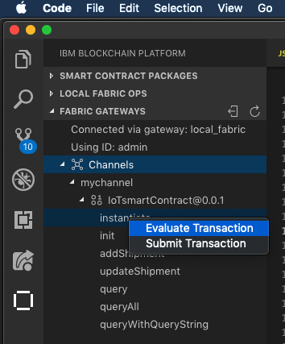
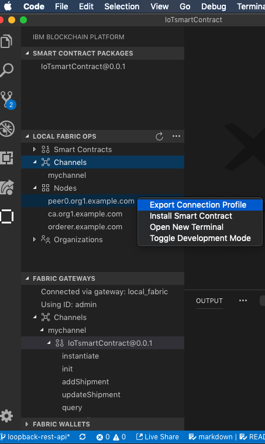

#The SmartContract
We start the blockchain portion of this code-pattern with
the setup of a basic Hyperledger Fabric v1.4.x network using Visual Studio Code ( VSCode )

## What you will learn:

1. How to package a smartcontract
1. How to work with it in developemnt mode in VSCode and the IBM Blockchain Extenstion.

#### Step I: Open VSCode in the required directory

In the command line console:
```sh
cd IoT-AssetTracking-Perishable-Network-Blockchain/Blockchain/IoTsmartContract

code .
```
TIP: it's important to be in this directory in order to perform the steps and operations below.


This will bring up the VSCode at the required directory  `IoTsmartContract` where we can work.

#### Step II:  package a smartcontract

Open the blockchain extenstion and look athe top panel 

SMART CONTRACT PACKAGES
click on the ellipsis (...)
and `choose package a smartcontract package`
if you have already done this you have 2 options:
a) delete the existing version of your IoTsmartContract@0.0.1
b) open up package.json and increase the version number to say 0.0.2

```json
{
    "name": "IoTsmartContract",
    "version": "0.0.2",
    ...
}
```

once you have changed the version go ahead and `choose package a smartcontract package`

if all goes well, you should see the packaged smartcotract in that panel
- in the bottom right hand toast/alert box, pay attention to the file location ( usaully under you user home dir ) - this is NB if deploying to the IBM Blockchain v2 on the cloud 

So once you have packaged up your SmartContract you will need to :

## start the local ( to VSCode's env )
Blockchain `Network`

In the second panel now called LOCAL FABRIC OPS
again click in the ellipis and choose `start fabric runtime` ( or in somecases you may want to stop/restart or teardown) the network and then restart it - note teardown will completely destroy and blockchain and world state / offchain data! )

Starting up the netork will bring up 5 docker containers on your environment.

we can see this by typing

```sh
docker ps

```
there should be at this stage 5 containers listed

1. The Certificate Authority - e.g. fabricvscodelocalfabric_ca.org1.example.com

1. Logger(Gilder) - e.g. fabricvscodelocalfabric_logspout

1. World state db (CouchDB) - e.g. fabricvscodelocalfabric_couchdb

1. Ordering service ( Solo ) - e.g. fabricvscodelocalfabric_orderer.example.com

1. Single Peer Node - e.g.  fabricvscodelocalfabric_peer0.org1.example.com

if you see these the local fabric blockchain network is up!

## now install your chain code
Again in the LOCAL FABRIC OPS panel,
open up the SmartContracts squiggly
click `+Install`
this will prompt you to select whick already SmartContract package you'd like to install.  Also what peer to instqall it on. In our case this is 
`peer0.org1.example.com` This should install it on that peer, and you should now it's name just above the `+Install` word.

## now once installed you'll need to Instantiate the smartcontract.
So a bit further down in the LOCAL FABRIC OPS panel, open up the Instantiated squiggly, and click on hgh `+Instantiate` word
choose the channel in this case `mychannel`
choose then the SmartContract and it's correct versipn from the choises
in our case IoTsmartrContracrt@0.0.1

( if upgrading you'll need to upgrade say IoTsmartrContracrt@0.0.1 to IoTsmartrContracrt@0.0.2 first!)

When instantiating  a smartcontract function, you will be asked 3 questions:
1)
Q: it will ask you what function you want to instantate / call?
These are any questions in your SmartContract.  You need to choose one
in order to finish the Blockchain network setup.
A: call the init function 

2)
Q: You will be asked to provide parameters
A: leave blank or empty list []

3)
Q: then you will be asked  to providing a private data collection config folder
A: No

The key point here is that by instantiating the function, it will spin up a 6th container:
the Peer container - e.g. fabricvscodelocalfabric-peer0.org1.example.com-IoTsmartContract-0.0.1


Once Instatiated, other functions can be called via the FABRIC GATEWAYS panel.



So how do we know this container ( the peer is working )?

There are 2 possibilites that we can try to achieve this:

a)  We can read the tail of the containers log ( stdout )

```sh
docker logs -f fabricvscodelocalfabric-peer0.org1.example.com-IoTsmartContract-0.0.1

```
b) Look at the output log in the VSCode window below

Here is a short video demonstrating this.

<< video here >>

So now we have a fully functional Blockchain network setup.  In order for our application to connect to it, we need to export the connection details

### Step III: Exporting the connection details
Switch to the IBM Blockchaing Platform view.  Then open up the LOCAL FABRIC OPS panel

Open the Nodes squiggly and right mouse click on the
peer0.org1.example.com node.  Select the Export Connection Profile from the popup menu.




Once you have exported the connection details you should now see a new directory `local_fabric` directly under the `IoTsmartContract` folder

```sh


IoTsmartContract
├── README.md
├── images
├── index.js
├── lib
├── local_fabric
├── node_modules
├── package-lock.json
└── package.json

```

Inside the `local_fabric` directory is a single file,
called `connection.json`. It should look similar to this:

``` JSON
{
    "name": "local_fabric",
    "version": "1.0.0",
    "wallet": "local_fabric_wallet",
    "client": {
        "organization": "Org1",
        "connection": {
            "timeout": {
                "peer": {
                    "endorser": "300"
                },
                "orderer": "300"
            }
        }
    },
    "organizations": {
        "Org1": {
            "mspid": "Org1MSP",
            "peers": [
                "peer0.org1.example.com"
            ],
            "certificateAuthorities": [
                "ca.org1.example.com"
            ]
        }
    },
    "peers": {
        "peer0.org1.example.com": {
            "url": "grpc://localhost:17051"
        }
    },
    "certificateAuthorities": {
        "ca.org1.example.com": {
            "url": "http://localhost:17054",
            "caName": "ca.org1.example.com"
        }
    }
}
```

So basically it is a configuration file stating
what the url's are for connection to the peers and certificate authorities to which you'll connect to from 
your application as defined in the next portion of this code pattern 

[to do insert the link here to loopback4 application README.md](..)


### help and troubleshooting

if you get this error

``` sh
npm ERR! Darwin 18.5.0
npm ERR! argv "/Users/Grant.Steinfeld@ibm.com/.nvm/versions/node/v6.17.1/bin/node" "/Users/Grant.Steinfeld@ibm.com/.nvm/versions/node/v6.17.1/bin/npm" "install"
npm ERR! node v6.17.1
npm ERR! npm  v3.10.10
npm ERR! code ELIFECYCLE

npm ERR! x509@0.3.3 install: `node-gyp rebuild`
npm ERR! Exit status 1
npm ERR! 
npm ERR! Failed at the x509@0.3.3 install script 'node-gyp rebuild'.
npm ERR! Make sure you have the latest version of node.js and npm installed.
npm ERR! If you do, this is most likely a problem with the x509 package,
npm ERR! not with npm itself.
npm ERR! Tell the author that this fails on your system:
npm ERR!     node-gyp rebuild
npm ERR! You can get information on how to open an issue for this project with:
npm ERR!     npm bugs x509
npm ERR! Or if that isn't available, you can get their info via:
npm ERR!     npm owner ls x509


```

use command

```sh
rm -rf node_modules/
npm install --ignore-scripts
```