# IoT Asset Tracking on a Hyperledger Blockchain

This section of the IoT Asset tracking workshop is really split into two parts. The first part, which we will call **Blockchain Part A**, follows the tutorial to deploy a [Hyperledger](https://www.hyperledger.org/) Fabric and Hyperledger Composer running in the [IBM Blockchain Starter Plan](https://www.ibm.com/blockchain/getting-started.html) in the IBM Cloud.

The IBM Blockchain tutorial is excellent and I won't try to repeat it here.  **Blockchain Part B** will detail how to implement a **Perishable Business Network** and Hyperledger Composer REST APIs. Finally, you'll get to work with Node-RED  to interact and visually see the tracking of the asset.

## Blockchain Part A - Build a basic IBM Blockchain Hyperledger network
The IBM Container Service free plan includes everything you need to deploy a Hyperledger Fabric (Blockchain runtime) and a Hyperledger Composer (UI for creating and deploying Business Networks to Fabric).  The [guide](https://www.ibm.com/developerworks/cloud/library/cl-ibm-blockchain-101-quick-start-guide-for-developers-bluemix-trs/index.html) makes it relatively simple. 

Here is a quick review of the steps in the guide  to creating your blockchain network:

* Follow the link to start your [blockchain network](http://www.ibm.com/blockchain/getting-started.html).
* Setup your IBM Cloud account.
* Create your starter plan instance. Call it **IoTAssetTrackingXXX** where XXX are your initials.
* Access your blockchain network.

Once your network is in place, you'll deploy one of the samples provided in the starter plan to test your network before moving on to Part B.
1. Inside your Blockchain Starter Plan service, select **Try samples** from the left navigational menu. 
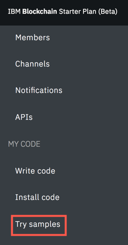

2. To deploy the Marbles sample to your network,, select **Deploy via Toolchain** .
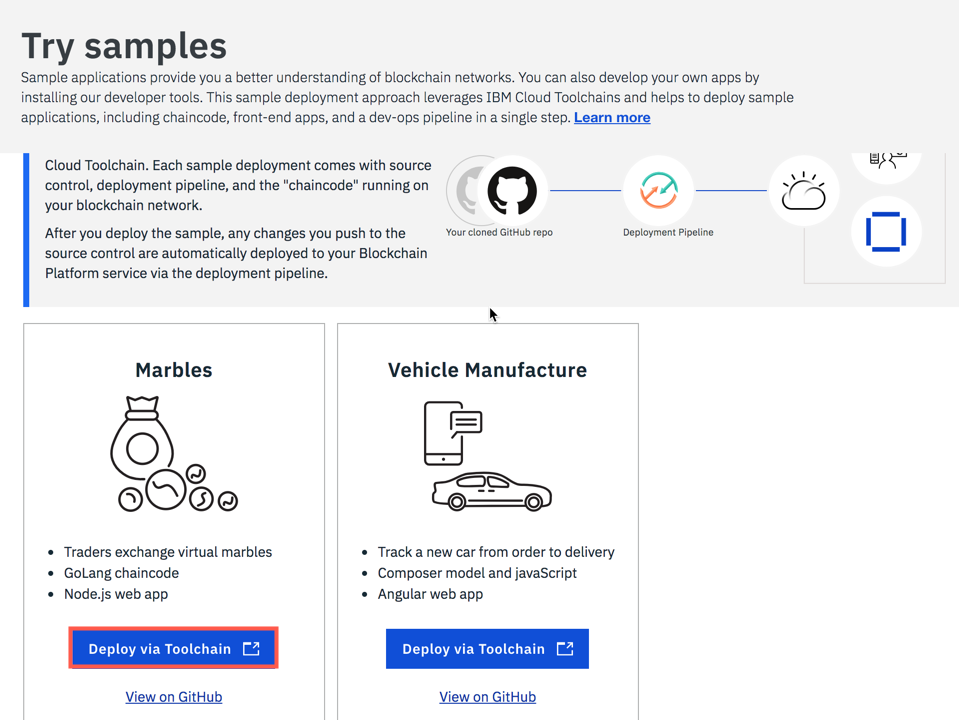

3.  On the create toolchain screen, customize your toolchain name to something you can enter to see your application. Change the *Toolchain Name* to **TryMarblesXXX** where XXX are your initials.


4. Scroll down the page. You'll notice that under *Tool Integrations*  it shows that *GitHub* and *Delivery Pipeline* say that they are required. Select **GitHub** to authenticate with your GitHub repository.
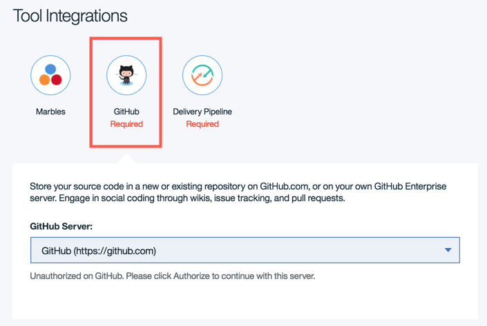

5. Leaving **GitHub** showing in the drop down box, click **Authorize**.
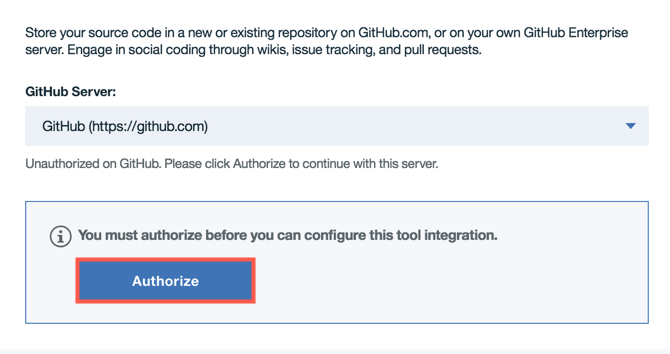

6. In the pop-up window, select **Authorize IBM-Cloud**.


7. Scroll down and update the *Repository Name* to something you'd like.
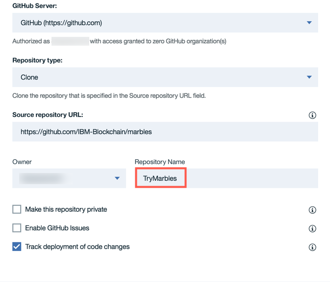

8. Click on **Marbles** to update *Tool Instance URL*, **https://TryMarblesXXX.mybluemix.net/login **, where XXX are your initials. Click **Create**.


9. Be patient while deployment takes place. This is a good time for a break as it can take 5-10 minutes.


10. Check on the progress of the application deployment:
* Switch tabs back to the **IBM Cloud tab**.
* Select the **menu bar icon** in the left corner.

* Navigate to **DevOps**.
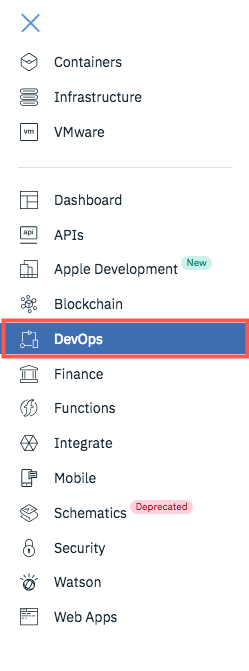
* Select the name of your marbles toolchain.
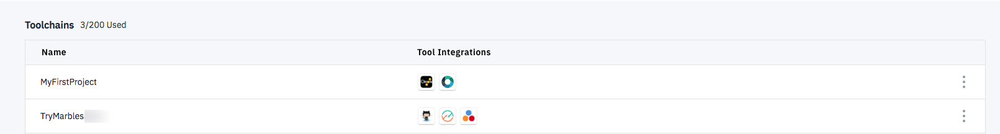
* Select **Delivery Pipeline**.
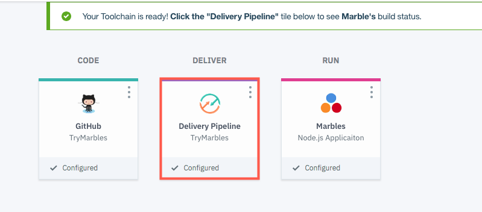
* Click **View logs and history** to watch the deployment.
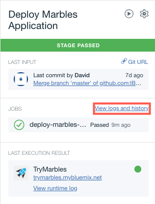
* When it is complete, you'll see a *passed* message at the top and *Finished: SUCCESS* at the bottom of the log.

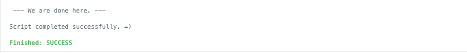

11. Using the breadcrumbs at the top, navigate back to the prior screen.
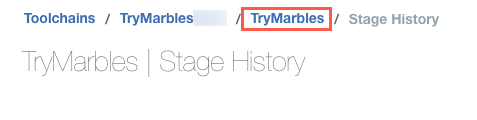

12. Click on the top link in the *Last Execution Result* to launch your application.
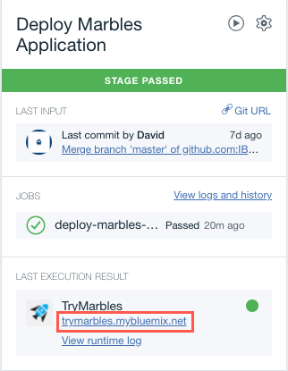

13.Click on **Guided** and follow the prompts to interact with your successfully deployed Marbles sample application.
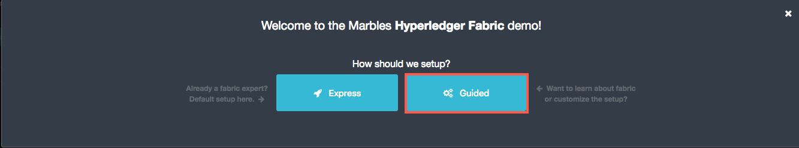

14. After following the guide, if all defaults all used, a page like this will be available. Congratulations! You have deployed a successful sample application! Your network is ready for you to build your own application. Feel free to play and explore this user interface.
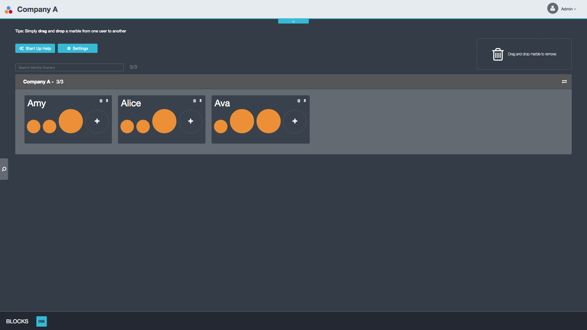


## Blockchain Part B - Implement a Perishable Business Network
To be able to work with Hyperledger Composer Playground, a web based user interface for developing blockchain applications from a business perspective, you'll need to install it locally on your machine. 
1. Press the **Launch Now** button
2. Click on **Deploy a new business network**
3. For our use case, you should substitute the **Perishable Network** sample instead of the basic Business Network.  Don't pick the first / prefilled basic-sample-network! Scroll down to the 'Samples on npm'.  The **perishable-network** is in the list of Model Network Starter Templates.  
4. Scroll down and choose **perishable-network** from the samples.
5. Give your new Business Network a name <span style="color:red">(1)</span> **perishable-network**
6. Give the network admin card that will be created a name <span style="color:red">(2)</span> **admin@perishable-network**

7. Scroll to the bottom, Click on <span style="color:red">(3)</span>  **ID and Secret**
8. Enter <span style="color:red">(4)</span> **admin** as the Enrollment ID
9. Enter <span style="color:red">(5)</span> **adminpw** as the Enrollment Secret

10. Scroll to the top of the page.
11. On the right sidebar, click on **Deploy**
12. Press **Connect now ->**


## Perishable Network Discussion
Let's pause for a moment to review the perishable-network you just deployed.  It tracks temperature but not geolocation information. There is an excellent three part Hyperledger series of articles in developerWorks that introduce the perishable-network.  
* [Hyperledger Composer basics, Part 1 -
Model and test your blockchain network](https://www.ibm.com/developerworks/cloud/library/cl-refine-deploy-your-blockchain-network-with-hyperledger-composer-playground/index.html)
* [Hyperledger Composer basics, Part 2 - Refine and deploy your blockchain network](https://www.ibm.com/developerworks/cloud/library/cl-refine-deploy-your-blockchain-network-with-hyperledger-composer-playground/index.html)
* [Hyperledger Composer basics, Part 3 - Deploy locally, interact with, and extend your blockchain network](https://www.ibm.com/developerworks/cloud/library/cl-deploy-interact-extend-local-blockchain-network-with-hyperledger-composer/index.html)

Part 2 includes instructions

> Then you'll make changes to the sample Perishable Goods network that you worked with in Part 1. Specifically, you'll model an IoT GPS sensor in the shipping container by adding GPS readings to the Shipment asset, and modify the smart contract (chaincode) to send an alert when the Shipment reaches its destination port.

Well, duh. THAT'S WHAT WE WANT TO DO....  With full step by step instructions. Triple word score.  Following all the links finds Steve Perry's [perishable-network git repository](
https://github.com/makotogo/developerWorks) that contains the variants he details in the dW articles.

Of course, those samples only got me so far because I also want to send accelerometer data from the Particle Electron Asset Tracker to the cloud.

We're going to need to learn a little bit about the Hyperledger Blockchain modeling language CTO files and chaincode. Part 1 of the dW Series (link above) is a good primer.

That brings me to my **forked implementation of the perishable-network**.  It adds accelerometer data transactions and chaincode.  It also changes the transactions to include environmental data, geolocation and a timestamp in one record.  My blockchain model implementation is necessary for this IoT Asset Tracking Perishable Network to function correctly.

This repository contains the forked [perishable.cto](IoT-Perishable-Network/perishable.cto) and the perishable [chaincode](IoT-Perishable-Network/logic.js)

## Replace the default perishable-network model and chaincode
The following instructions replace the default perishable-network model and chaincode with my implementation.
1. Recall that you've pressed the **Connect now ->** button.
2. Click on the **Model File** (1) in the Files sidebar
3. Place your cursor in the Model File editor, Ctrl-A to select all the text.  Ctrl-D to delete the text.
4. Visit [perishable.cto](IoT-Perishable-Network/perishable.cto) and copy that file to your clipboard.
5. Paste in my modified Model from github into the model.
6. Scroll down in the Files sidebar
7. Click on **Script File** (2) in the Files sidebar
8. Place your cursor in the Script File editor, Ctrl-A to select all the text. Ctrl-D to delete the text.
9. Visit [chaincode](IoT-Perishable-Network/logic.js) and copy that file to your clipboard.
10. Paste in my modified chaincode from github into the Script file.
11. Press the Update button


## Expose the Perishable Business Network as a REST API

To manipulate the blockchain from Node-RED, we will expose the perishable-network business network using the Hyperledger Composer REST API.  
1. Return to the [Hyperledger tutorial](https://ibm-blockchain.github.io/interacting/) and complete the instructions in Step 4.  Essentially you will want to run
```
$ cd cs-offerings/scripts/
$ ./create/create_composer-rest-server.sh --business-network-card admin@perishable-network
```
2. Visit the Swagger documentation for your blockchain REST API.
```
http://YOUR_PUBLIC_IP_HERE:31090/explorer
```

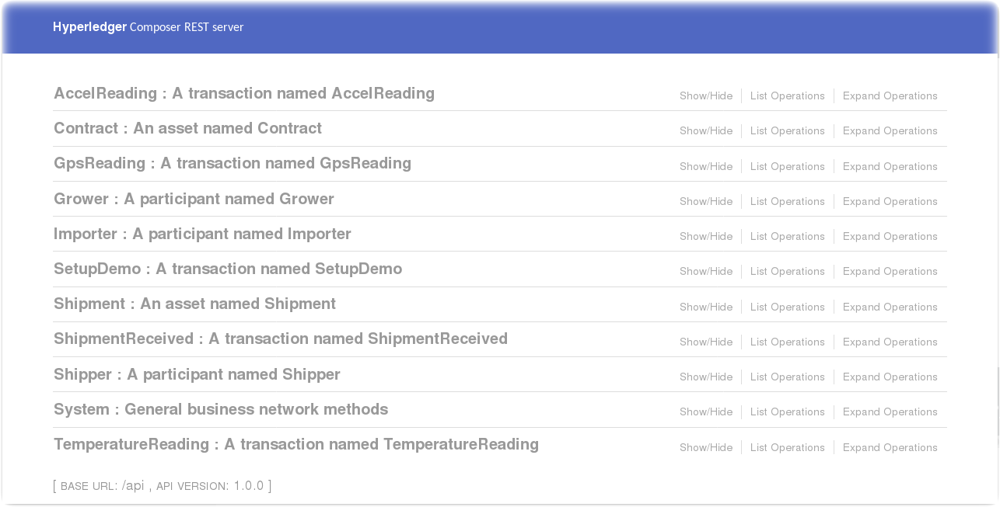

Congratulations!  You have completed the Blockchain section of the workshop.  Proceed to the [Node-RED section](../Node-RED/README.md) which will leverage the REST API you just enabled to write / read / visualize IoT Asset environmental sensor data to the transaction history.
