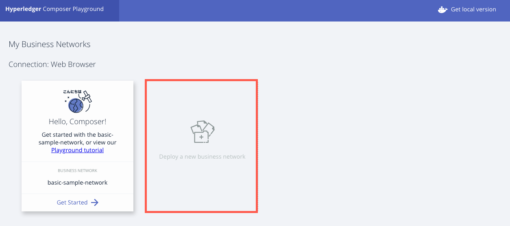
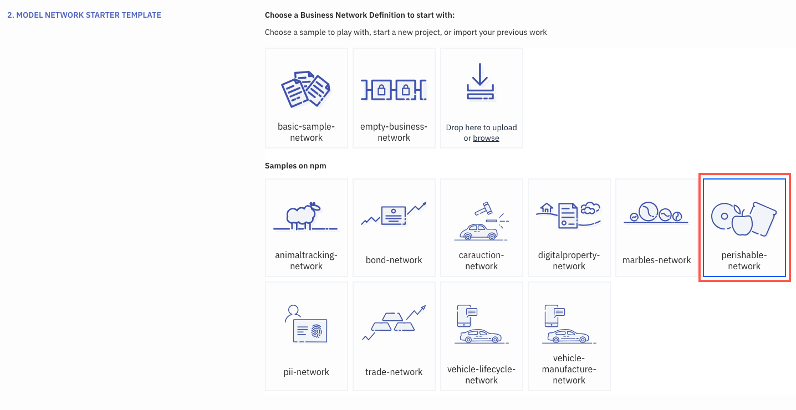
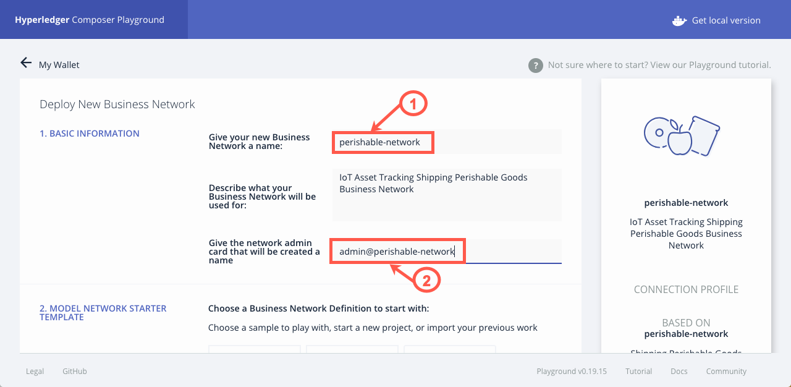
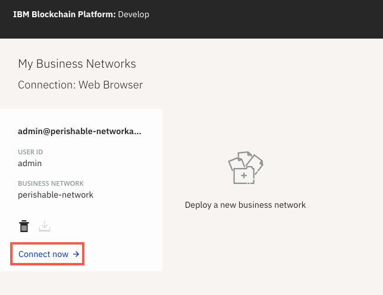

# IoT Asset Tracking on Hyperledger Fabric Blockchain


## Pre-requisites
NVM
https://github.com/creationix/nvm

Node v8.15.x
npm 6.4.x

docker 
centos7
```
echo "installing docker"
  241  curl -fsSL https://get.docker.com/ | sh
  242  sudo usermod -aG docker gsteinfeld
  243  docker ps
  244  sudo systemctl start docker
  245  sudo systemctl status docker
  246  docker ps
  247  sudo systemctl enable docker
  reboot
  echo 'reboot needed to fix sock permission issue'
```
## Local development
=======

When the reader has completed this part 3 of this code pattern, they will understand how to:


* Build a blockchain network using Hyperledger Fabric v1.4
* Deploy the blockchain to a (free) Kubernetes Cluster on the IBM Cloud
* Build and Deploy a NodeJS LoopBack 4 client that communicates with  the blockchains smart contract

## Architecture Flow Diagram


# Flow Description
1. ?tbd? The blockchain operator sets up the IBM Blockchain Platform 2.0 service.

2. ?tbd ?The IBM Blockchain Platform 2.0 

  OR User creates a Hyperledger Fabric network on an IBM Kubernetes 
  Service, [ and deploys by hand the docker stuff ] and the operator installs and instantiates the smart contract on the network.

3. The Node.js application server uses the Fabric SDK to interact with the deployed network on IBM Blockchain Platform 2.0 and creates APIs for a web client.

4. The Loopback 4 client uses the Node.js application API to interact with the network.

5. The user interacts with the Loopback 4 web interface to update and query the blockchain ledger and state.


```sh
git clone https://github.com/johnwalicki/IoT-AssetTracking-Perishable-Network-Blockchain.git
cd IoT-AssetTracking-Perishable-Network-Blockchain
cd Blockchain/IoTsmartContract/
code .
```

you will now be in the Smart Contract ( IoTsmartContract ) folder

click on square blockchain icon in left toolbar
this expands the IBM BLOCKCHAIN PLATFORM panel
in the top section
 SMART CONTRACT PACKAGES

 right click the ... and Package a Smart Contract Project

in the middle section
 LOCAL FABRIC OPS
 right click the ... and Start Fabric Runtime

 Installed/ +Install 
 install the newly packaged contract

 in the Instantiated/ +Instantiate 
 instantiate the new contract
 on 'mychannel' choose the init function
 and leave the args empty.

 now the local_fabric Blockchain is ready

 check?
 in a terminal window
 type:

 ```sh
 docker ps
 ```

 you should see 6 docker containers:

 1. gliderlabs/logspout
 1. hyperledger/fabric-orderer:1.4.0
 1. hyperledger/fabric-ca:1.4.0
 1. hyperledger/fabric-couchdb:0.4.14
 1. hyperledger/fabric-peer:1.4.0
 1. fabricvscodelocalfabric-peer0.org1.example.com-iotsmartcontract-0.0.1


### In order to interact with Blockchain, you will need to export the Connection Details ( aka the cerficicate details, user indentities and network IP addresses )

<< add nice screen shots here >>
in middle panel
LOCAL FABRIC OPS

open Nodes
right mouse click on peer0.org1.example.com
and `Export Connection Details` this process will export the peer's admin certificates to a folder called local_fabric

with the success message:
```text
Successfully exported connection details to /Users/<<your-username>>/Documents/dev/IoT-AssetTracking-Perishable-Network-Blockchain/Blockchain/local_fabric
```

this will export the Admin@org1.example.com public/private key pair so that the web-app client can communicate with this Network.

<>


This section of the IoT Asset tracking workshop is really split into two parts. The first part, which we will call **Blockchain Part A**, follows the tutorial to deploy a [Hyperledger](https://www.hyperledger.org/) Fabric and Hyperledger Composer running in the [IBM Blockchain Starter Plan](https://www.ibm.com/blockchain/getting-started.html) in the IBM Cloud.

**Note:** User could incur charges!

* The IBM Blockchain Starter Plan is free for only 30 days through IBM Cloud credits and could change at any time. You may need to enter your credit card information to be able to deploy the Blockchain Starter Plan. There will be notes at the end of the code pattern to remove the instances to help eliminate the potential risk of charges.

There are quite a few IBM Blockchain tutorials that are excellent and we won't try to repeat them here.  We will be using a couple of them along the way. In **Blockchain Part A** we are going to create our blockchain business network of perishable goods. In **Blockchain Part B** we will convert it into smart contracts to deploy to the IBM Blockchain Starter Plan. We will use part of the IBM Cloud called DevOps to build our code and deploy it to an instance of the IBM Blockchain Starter Plan. The build process will also deploy a Hyperledger Composer Rest Server running as a Cloud Foundry service in the IBM Cloud. The Hyperledger Composer REST APIs will be used by Node-RED to talk to the blockchain perishable network. Finally, you'll get to work with Node-RED  to interact and visually see the tracking of the asset.

## Blockchain Part A - Build your perishable network

We will be using Hyperledger Composer Playground to build our perishable network. When we are done, we will export the code to our local system to use in Part B.

### Import the sample perishable network into Hyperledger Composer Playground
1. Access the [IBM Hyperledger Composer Playground](http://composer-playground.mybluemix.net/).
2. Click on **Deploy a new business network**
  
3. Scroll down and choose **perishable-network** from the samples on npm.
  
4. Scrolling back to the top, you should now have a business network name of **xxx-perishable-network**, where xxx is a unique identifer. 
   * Note: The unique identifier becomes very important later on in this code pattern because this business network name is used to create a rest server on the IBM Cloud. If the name is not unique then it will fail during the build process.
5. Give the network admin card that will be created a name **admin@xxx-perishable-network**.
  
6. On the right sidebar, click on **Deploy**.
7. Press **Connect now ->**



### Customize the perishable network for IoT tracking
Let's pause for a moment to review the perishable-network you just deployed.  It tracks temperature but not geolocation information. There is an excellent three part Hyperledger series of articles in developerWorks that introduce the perishable-network.  
* [Hyperledger Composer basics, Part 1 - Model and test your blockchain network](https://www.ibm.com/developerworks/cloud/library/cl-refine-deploy-your-blockchain-network-with-hyperledger-composer-playground/index.html)
* [Hyperledger Composer basics, Part 2 - Refine and deploy your blockchain network](https://www.ibm.com/developerworks/cloud/library/cl-refine-deploy-your-blockchain-network-with-hyperledger-composer-playground/index.html)
* [Hyperledger Composer basics, Part 3 - Deploy locally, interact with, and extend your blockchain network](https://www.ibm.com/developerworks/cloud/library/cl-deploy-interact-extend-local-blockchain-network-with-hyperledger-composer/index.html)

Part 2 includes instructions

> Then you'll make changes to the sample Perishable Goods network that you worked with in Part 1. Specifically, you'll model an IoT GPS sensor in the shipping container by adding GPS readings to the Shipment asset, and modify the smart contract (chaincode) to send an alert when the Shipment reaches its destination port.

Well, duh. THAT'S WHAT WE WANT TO DO....  With full step by step instructions. Triple word score.  Following all the links finds Steve Perry's [perishable-network git repository](
https://github.com/makotogo/developerWorks) that contains the variants he details in the dW articles.

Of course, those samples only got me so far because I also want to send accelerometer data from the Particle Electron Asset Tracker to the cloud.

We're going to need to learn a little bit about the Hyperledger Blockchain modeling language CTO files and chaincode. Part 1 of the dW Series (link above) is a good primer.

In the following steps, we will make changes to the model file to add in accelerometer data, environmental data, geolocation and a timestamp. Adding in the IoT data will also require additional transactions. To save time after we complete the model file updates, we will import the transactions from a cloned repository.

1. In the **enum ProductType**, add a variable to the enum for **medicine**.
=======
``` text
Blockchain
├── IoTsmartContract
├── README.md
├── local_fabric
└── web-app
```
Great, we are making good progress, hang in there!

### Enrolling an Admin and a User
### to the peer so that the web-app/app loopback client can communicate with the Blockchain network

```sh
cd ./web-app/server
npm install
node enrollAdmin.js
> msg: Successfully enrolled admin user and imported it into the wallet
node registerUser.js
> msg: Successfully registered and enrolled  user user1 and imported it into the wallet
```


under the server folder you should now see a new folder called `wallet` which contains
the public and private TLS keys needed by the web-app/app to communicate securely with our newly stood up Blockchain network.

```
server
├── config.json
├── enrollAdmin.js
├── registerUser.js
└── wallet
    ├── admin
    └── user1
```
### Run the loopback blockchain NodeJS client
So lets run the application.

```
cd web-app/app
```

install the node modules required for Fabric and Loopback
```
npm install
```
you should see a new folder containing all the nodeJS packages called ` node_modules`

At this time of writing I got a reply something like
`added 759 packages from 1533 contributors and audited 4558 packages in 32.26s` which is good!


### lets run the application
``` sh
npm start
> Server is running at http://127.0.0.1:3000
```

You should be able to view and try the API out by clicking here: [http://127.0.0.1:3000/explorer](http://127.0.0.1:3000/explorer)

You should 
be able to discover the REST api and exercise it directly from you webbrowser.


# Once you are satisfied with and have tested your local setup you are ready for - Remote Deployment to the IBM Cloud.

## Blockchain Network
<< IBPv2(beta!) / Kubernetes Cluster to IBM Cloud>>

## Loopback Fabric REST API client
<< cloud foundry>>

## resources
### IBM
https://developer.ibm.com/

https://developer.ibm.com/patterns/develop-an-iot-asset-tracking-app-using-blockchain/


### external
https://loopback.io/

## troubleshooting
<<to be filled in - gPRC error etc ...>>
https://github.com/grpc/grpc/issues/15431

### Credits
John Walicki
Jennifer Francis
Grant Steinfeld

