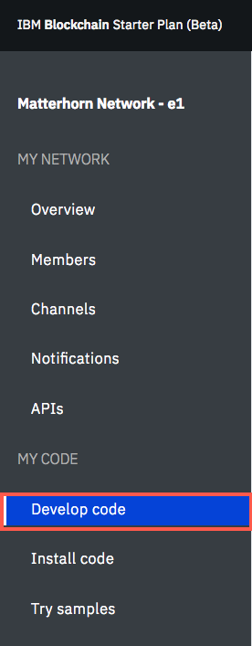
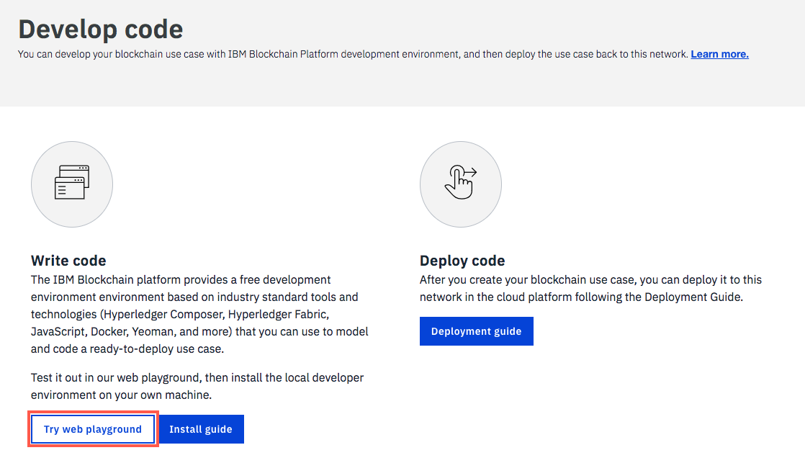
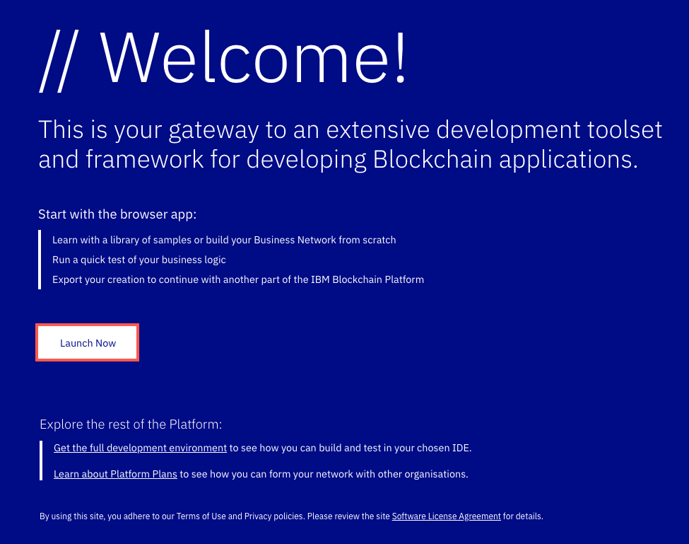

# IoT Asset Tracking on a Hyperledger Blockchain

This section of the IoT Asset tracking workshop is really split into two parts. The first part, which we will call **Blockchain Part A**, follows the tutorial to deploy a [Hyperledger](https://www.hyperledger.org/) Fabric and Hyperledger Composer running in the [IBM Blockchain Starter Plan](https://www.ibm.com/blockchain/getting-started.html) in the IBM Cloud.

The IBM Blockchain tutorial is excellent and I won't try to repeat it here.  **Blockchain Part B** will detail how to implement a **Perishable Business Network** and Hyperledger Composer REST APIs. Finally, you'll get to work with Node-RED  to interact and visually see the tracking of the asset.

## Blockchain Part A - Build a basic IBM Blockchain Hyperledger network
The IBM Container Service free plan includes everything you need to deploy a Hyperledger Fabric (Blockchain runtime) and a Hyperledger Composer (UI for creating and deploying Business Networks to Hyperledger Fabric).  The [guide](https://www.ibm.com/developerworks/cloud/library/cl-ibm-blockchain-101-quick-start-guide-for-developers-bluemix-trs/index.html) makes it relatively simple. 

More information on the IBM Blockchain Starter Plan can be found [here](https://console.bluemix.net/docs/services/blockchain/dashboard.html#write-code).

Here is a quick review of the steps in the guide  to creating your blockchain network:

* Follow the link to start your [blockchain network](http://www.ibm.com/blockchain/getting-started.html).
* Setup your IBM Cloud account.
* Create your starter plan instance. Call it **IoTAssetTrackingXXX** where XXX are your initials.
* Access your blockchain network.

Once your network is in place, you'll deploy one of the samples provided in the starter plan to test your network before moving on to Part B.
1. Inside your Blockchain Starter Plan service, select **Try samples** from the left navigational menu. 


2. To deploy the Marbles sample to your network,, select **Deploy via Toolchain** .


3.  On the create toolchain screen, customize your toolchain name to something you can enter to see your application. Change the *Toolchain Name* to **TryMarblesXXX** where XXX are your initials.


4. Scroll down the page. You'll notice that under *Tool Integrations*  it shows that *GitHub* and *Delivery Pipeline* say that they are required. Select **GitHub** to authenticate with your GitHub repository.


5. Leaving **GitHub** showing in the drop down box, click **Authorize**.


6. In the pop-up window, select **Authorize IBM-Cloud**.


7. Scroll down and update the *Repository Name* to something you'd like.


8. Click on **Marbles** to update *Tool Instance URL*, **https://TryMarblesXXX.mybluemix.net/login **, where XXX are your initials. Click **Create**.


9. Be patient while deployment takes place. This is a good time for a break as it can take 5-10 minutes.


10. Check on the progress of the application deployment:
* Switch tabs back to the **IBM Cloud tab**.
* Select the **menu bar icon** in the left corner.

* Navigate to **DevOps**.

* Select the name of your marbles toolchain.

* Select **Delivery Pipeline**.

* Click **View logs and history** to watch the deployment.

* When it is complete, you'll see a *passed* message at the top and *Finished: SUCCESS* at the bottom of the log.


11. Using the breadcrumbs at the top, navigate back to the prior screen.


12. Click on the top link in the *Last Execution Result* to launch your application.


13.Click on **Guided** and follow the prompts to interact with your successfully deployed Marbles sample application.


14. After following the guide, if all defaults all used, a page like this will be available. Congratulations! You have deployed a successful sample application! Your network is ready for you to build your own application. Feel free to play and explore this user interface.


## Blockchain Part B - Implement a Perishable Business Network
Now it's time for the fun to begin! We are going to break this down into a few sections:

* [Creating your blockchain network in Hyperledger Composer Playground running on IBM Cloud](#create-your-blockchain-network-in-hyperledger-composer-playground-on-ibm-cloud)
* [Modify the blockchain network](#customise-the-parishable-network)
* [Deploying your blockchain network to your IBM Blockchain Starter Plan](#deploy-your-network)
* Generating your API for your deployed blockchain network with Hyperledger Composer Rest Server


### Create your blockchain network in Hyperledger Composer Playground on IBM Cloud

1. ​Inside your IBM Blockchain Starter Plan, under *My Code* on the left side of the screen, select **Develop code**.


2. In the main section of the page, choose to **Try web playground** to launch Hyperledger Composer Playground running in IBM Cloud.
* Note: This instance of Hyperledger Composer Playground only exists in your browser. If you close your browser or it crashes, it is possible you could lose your work. To avoid losing your work, you can *Export* your code to your desktop.


3. From the *Welcome* page, click **Launch Now**.


4. Click on **Deploy a new business network**


5. Scroll down and choose **perishable-network** from the samples on npm.


6. Scrollign back to the top, you should now have a business network name of **perishable-network**.
7. Give the network admin card that will be created a name **admin@perishable-network**.

8. On the right sidebar, click on **Deploy**.
9. Press **Connect now ->**.


### Customize the parishable network
Let's pause for a moment to review the perishable-network you just deployed.  It tracks temperature but not geolocation information. There is an excellent three part Hyperledger series of articles in developerWorks that introduce the perishable-network.  
* [Hyperledger Composer basics, Part 1 -Model and test your blockchain network](https://www.ibm.com/developerworks/cloud/library/cl-refine-deploy-your-blockchain-network-with-hyperledger-composer-playground/index.html)
* [Hyperledger Composer basics, Part 2 - Refine and deploy your blockchain network](https://www.ibm.com/developerworks/cloud/library/cl-refine-deploy-your-blockchain-network-with-hyperledger-composer-playground/index.html)
* [Hyperledger Composer basics, Part 3 - Deploy locally, interact with, and extend your blockchain network](https://www.ibm.com/developerworks/cloud/library/cl-deploy-interact-extend-local-blockchain-network-with-hyperledger-composer/index.html)

Part 2 includes instructions

> Then you'll make changes to the sample Perishable Goods network that you worked with in Part 1. Specifically, you'll model an IoT GPS sensor in the shipping container by adding GPS readings to the Shipment asset, and modify the smart contract (chaincode) to send an alert when the Shipment reaches its destination port.

Well, duh. THAT'S WHAT WE WANT TO DO....  With full step by step instructions. Triple word score.  Following all the links finds Steve Perry's [perishable-network git repository](
https://github.com/makotogo/developerWorks) that contains the variants he details in the dW articles.

Of course, those samples only got me so far because I also want to send accelerometer data from the Particle Electron Asset Tracker to the cloud.

We're going to need to learn a little bit about the Hyperledger Blockchain modeling language CTO files and chaincode. Part 1 of the dW Series (link above) is a good primer.

That brings me to my **forked implementation of the perishable-network**.  It adds accelerometer data transactions and chaincode.  It also changes the transactions to include environmental data, geolocation and a timestamp in one record.  My blockchain model implementation is necessary for this IoT Asset Tracking Perishable Network to function correctly.

This repository contains the forked [perishable.cto](IoT-Perishable-Network/perishable.cto) and the perishable [chaincode](IoT-Perishable-Network/logic.js)

#### Replace the default perishable-network model and chaincode
The following instructions replace the default perishable-network model and chaincode with my implementation.
1. Recall that you've pressed the **Connect now ->** button.
2. Click on the **Model File** (1) in the Files sidebar
3. Place your cursor in the Model File editor, Ctrl-A to select all the text.  Ctrl-D to delete the text.
4. Visit [perishable.cto](IoT-Perishable-Network/perishable.cto) and copy that file to your clipboard.
5. Paste in my modified Model from github into the model.
6. Click **Update** to save your changes in the browser.
7. Scroll down in the Files sidebar.
8. Click on **Script File** (2) in the Files sidebar
9. Place your cursor in the Script File editor, Ctrl-A to select all the text. Ctrl-D to delete the text.
10. Visit [chaincode](IoT-Perishable-Network/logic.js) and copy that file to your clipboard.
11. Paste in my modified chaincode from github into the Script file.
12. Press the Update button.


13. **Export** the code to your local system. We will use it during the deployment process.


14. Save the business network archive, **perishable-network.bna**, somewhere you can easily find it.


###Deploy your network
Now that you've created your blockchain application, it's time to make it run on the IBM Blockchain Starter Plan. To do that, we are going to use the DevOps service in the IBM Cloud to deploy our code and start a REST server. This entire process is documented [here](https://github.com/sstone1/blockchain-starter-kit/blob/master/README.md) if you are interested in doing something similar outside of this exercise. This breaks down into the following steps:
* [Create a DevOps toolchain](#create-a-devops-toolchain)
* [Installing Hyperledger Composer locally](#install-hyperledger-composer-locally)
* [Moving your code into your repository](#prepare-your-code-for-deployment)
* [Verifying deployment of code](#verify-deployment)

####Create a DevOps toolchain
1. Start [here](https://console.bluemix.net/devops/setup/deploy/?repository=https%3A//github.com/sstone1/blockchain-starter-kit&branch=master&env_id=ibm%3Ayp%3Aus-south) to create your DevOps toolchain. 

2. Enter a name for your toolchain. Make it unique!


3. Scroll down and create a unique repository name, **XXX-blockchain-toolkit** where XXX are your initials.

4. Click **Create**.


5. Congratulations! You have a complete toolchain that can be used to deploy your code.


The "GitHub" button in the middle will take you to your newly created GitHub repository. You will clone this GitHub repository into your local development environment, so you can work on your blockchain application.

The "Delivery Pipeline" button on the right will take you to the delivery pipeline for your DevOps toolchain. From here, you can inspect the output from the latest automated build and deployment of your blockchain application.

####Install Hyperledger Composer locally
To deploy our code, we'll need to work with some of the Hyperledger Composer commands on our system.

1. Follow the [directions](https://hyperledger.github.io/composer/latest/installing/installing-index) for installing the prerequisites and installing Hyperledger Composer. 
* Only complete Step 1 and Step 2 of intalling Hyperledger Composer for this exercise.

####Prepare your code for deployment
1. In your toolchain, select the **GitHub** icon to open your newly created repository.


2. In GitHub, click **Clone or download** and then the **copy** button to get the URL to use to clone your repository to your local system.


3. In a terminal on your local system, enter `git clone <URL>` where <URL> is the value you copied in the previous step.
```
 ~  git clone https://github.com/SweetJenn23/XXX-blockchain-starter-kit.git
Cloning into 'XXX-blockchain-starter-kit'...
remote: Counting objects: 40, done.
remote: Compressing objects: 100% (35/35), done.
remote: Total 40 (delta 2), reused 40 (delta 2), pack-reused 0
Unpacking objects: 100% (40/40), done.
```

4. Move ito your the contracts directory, `cd XXX-blockchain-starter-kit/contracts` where XXX are your intitials.

5. We need to make a smart contract from our blockchain network (.bna). To do this we will use one of the tools installed with Hyperledger Composer called Yeoman. This will create a smart contract skeleton we can deploy to Hyperledger Fabric. We will have to copy our work into this skeleton. 

To make the skeleton, type `yo` into a terminal on your local system and create a business network named **XXX-perishable-network** where XXX are your initials. Complete the rest of the information in the prompts.


6. To copy our code into the skeleton you'll need to expand the business network archive.
* In your terminal, change directory to where your **perishable-network.bna** is saved.
* Change the extension on the file. `mv perishable-network.bna perishable-network.zip`
* Unzip the file. `unzip perishable-network.zip`
```
> unzip perishable-network.zip
Archive:  perishable-network.zip
 extracting: package.json
 extracting: README.md
 extracting: permissions.acl
   creating: models/
 extracting: models/perishable.cto
   creating: lib/
 extracting: lib/logic.js
```
7. Copy the extracted files into your cloned GitHub directory, */XXX-blockchain-starter-kit/contracts/xxx-perishable-network*. Replace the files already in the *xxx-perishable-network* directory with the same name. Do this for all of the following files:
* README.md
* permissions.acl
* perishable.cto
* logic.js


8. To commit the code to your repository on GitHub for the toolchain you'll need to use the following in a terminal in your **XXX-blockchain-starter-kit** directory:
* `git add -A`
* `git commit -m "Update files"`
* `git push`


####Verify deployment
When you committed your code to GitHub, the DevOps toolchain automatically picked up the changes. The toolchain will immediately begin deploying those changes.

1. Navigate to the DevOps toolchain page, and click on the "Delivery Pipeline" button. You should see the following page, giving you an overview of the current status of your delivery pipeline:

## Expose the Perishable Business Network as a REST API

To manipulate the blockchain from Node-RED, we will expose the perishable-network business network using the Hyperledger Composer REST API.  
1. Return to the [Hyperledger tutorial](https://ibm-blockchain.github.io/interacting/) and complete the instructions in Step 4.  Essentially you will want to run
```
$ cd cs-offerings/scripts/
$ ./create/create_composer-rest-server.sh --business-network-card admin@perishable-network
```
2. Visit the Swagger documentation for your blockchain REST API.
```
http://YOUR_PUBLIC_IP_HERE:31090/explorer
```


Congratulations!  You have completed the Blockchain section of the workshop.  Proceed to the [Node-RED section](../Node-RED/README.md) which will leverage the REST API you just enabled to write / read / visualize IoT Asset environmental sensor data to the transaction history.
