# IoT Asset Tracking on a Hyperledger Blockchain

This section of the IoT Asset tracking workshop is really split into two parts. The first part, which we will call **Blockchain Part A**, follows the tutorial to deploy a [Hyperledger](https://www.hyperledger.org/) Fabric and Hyperledger Composer running in the [IBM Blockchain Starter Plan](https://www.ibm.com/blockchain/getting-started.html) in the IBM Cloud.

There are quite a few IBM Blockchain tutorials that are excellent and we won't try to repeat them here.  We will be using a couple of them along the way. In **Blockchain Part A** we are going to create our blockchain business network of perishable goods. In **Blockchain Part B** we will convert it into smart contracts to deploy to the IBM Blockchain Starter Plan. We will use part of the IBM Cloud called DevOps to build our code and deploy it to an instance of the IBM Blockchain Starter Plan. The build process will also deploy a Hyperledger Composer Rest Server running as a Cloud Foundry service in the IBM Cloud. The Hyperledger Composer REST APIs will be used by Node-RED to talk to the blockchain perishable network. Finally, you'll get to work with Node-RED  to interact and visually see the tracking of the asset.

## Blockchain Part A - Build your perishable network

We will be using Hyperledger Composer Playground to build our perishable network. When we are done, we will export the code to our local system to use in Part B.

### Import the sample perishable network into Hyperledger Composer Playground
1. Access the [IBM Hyperledger Composer Playground](https://blockchaindevelop.mybluemix.net/test).
2. Click on **Deploy a new business network**

3. Scroll down and choose **perishable-network** from the samples on npm.

4. Scrolling back to the top, you should now have a business network name of **perishable-network**.
5. Give the network admin card that will be created a name **admin@perishable-network**.

6. On the right sidebar, click on **Deploy**.
7. Press **Connect now ->**


### Customize the perishable network for IoT tracking
Let's pause for a moment to review the perishable-network you just deployed.  It tracks temperature but not geolocation information. There is an excellent three part Hyperledger series of articles in developerWorks that introduce the perishable-network.  
* [Hyperledger Composer basics, Part 1 - Model and test your blockchain network](https://www.ibm.com/developerworks/cloud/library/cl-refine-deploy-your-blockchain-network-with-hyperledger-composer-playground/index.html)
* [Hyperledger Composer basics, Part 2 - Refine and deploy your blockchain network](https://www.ibm.com/developerworks/cloud/library/cl-refine-deploy-your-blockchain-network-with-hyperledger-composer-playground/index.html)
* [Hyperledger Composer basics, Part 3 - Deploy locally, interact with, and extend your blockchain network](https://www.ibm.com/developerworks/cloud/library/cl-deploy-interact-extend-local-blockchain-network-with-hyperledger-composer/index.html)

Part 2 includes instructions

> Then you'll make changes to the sample Perishable Goods network that you worked with in Part 1. Specifically, you'll model an IoT GPS sensor in the shipping container by adding GPS readings to the Shipment asset, and modify the smart contract (chaincode) to send an alert when the Shipment reaches its destination port.

Well, duh. THAT'S WHAT WE WANT TO DO....  With full step by step instructions. Triple word score.  Following all the links finds Steve Perry's [perishable-network git repository](
https://github.com/makotogo/developerWorks) that contains the variants he details in the dW articles.

Of course, those samples only got me so far because I also want to send accelerometer data from the Particle Electron Asset Tracker to the cloud.

We're going to need to learn a little bit about the Hyperledger Blockchain modeling language CTO files and chaincode. Part 1 of the dW Series (link above) is a good primer.

In the following steps, we will make changes to the model file to add in accelerometer data, environmental data, geolocation and a timestamp. Adding in the IoT data will also require additional transactions. To save time after we complete the model file updates, we will import the transactions from a cloned repository.

1. In your model file,  scroll until you find **enum CompassDirection**. Enter the following values to enumerate the four cardinal directions:
```
/**
 * Directions of the compass
 */
enum CompassDirection {
  o N
  o S
  o E
  o W
}
```
2. Now we need some transaction models to be able to get data from our sensors.  In the empty **transaction AccelReading extends ShipmentTransaction** complete the following information:
```
transaction AccelReading extends ShipmentTransaction {
  o Double accel_x
  o Double accel_y
  o Double accel_z
  o String latitude
  o String longitude
  o String readingTime
}
```
3. For **transaction TemperatureReading extends ShipmentTransaction**  modify the transaction to match the following variables:
```
transaction TemperatureReading extends ShipmentTransaction {
  o Double celsius
  o String latitude
  o String longitude
  o String readingTime
}
```
4. It's time to setup the **transaction GpsReading extends ShipmentTransaction**:
```
transaction GpsReading extends ShipmentTransaction {
  o String readingTime
  o String readingDate
  o String latitude
  o CompassDirection latitudeDir
  o String longitude
  o CompassDirection longitudeDir
}
```

5. For the IoT data to be associated with the asset, shipment, we will need to add some IoT related variables to the asset model for shipment. Make the following additions to the shipment model.
* AccelReading[] AccelReadings optional
* GpsReading[] gpsReadings optional
```
asset Shipment identified by shipmentId {
  o String shipmentId
  o ProductType type
  o ShipmentStatus status
  o Long unitCount
  --> Contract contract
  o TemperatureReading[] temperatureReadings optional
  o AccelReading[] AccelReadings optional
  o GpsReading[] gpsReadings optional
}
```

6. Our contract will also now be dependent on the shipment arriving without any incidents captured by the accelerometer. We will need to add a field for the accelerometer value to the contract asset model. This will allow us to specify conditions for a crash, a hard jolt or other incidents based on the accelerometer data in the logic.js file.
* Add **Double maxAccel** to the Contract asset model.
```
asset Contract identified by contractId {
  o String contractId
  --> Grower grower
  --> Shipper shipper
  --> Importer importer
  o DateTime arrivalDateTime
  o Double unitPrice
  o Double minTemperature
  o Double maxTemperature
  o Double minPenaltyFactor
  o Double maxPenaltyFactor
  o Double maxAccel
}
```
7. Now we need to create some events so we can alert the appropriate participants when agreed upon thresholds are exceeded. Scroll down and fill in the following information for the **TemperatureThresholdEvent**.
```
event TemperatureThresholdEvent {
  o String message
  o Double temperature
  o String latitude
  o String longitude
  o String readingTime
  --> Shipment shipment
}
```

8. Create the variables for the **AccelerationThresholdEvent**.
```
event AccelerationThresholdEvent {
  o String message
  o Double accel_x
  o Double accel_y
  o Double accel_z
  o String latitude
  o String longitude
  o String readingTime
  --> Shipment shipment
}
```
9. Complete the information to create the model for the event **ShipmentInPort**.
```
event ShipmentInPortEvent {
  o String message
  --> Shipment shipment
}
```

10. Our model file is now complete. Select **Update** to save the changes in the Hyperledger Composer Playground.
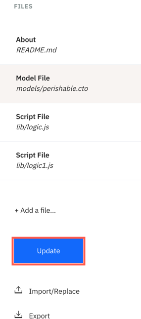

11. Now it is time to **copy** (CTRL+C) our new logic.js file from our [repository](https://raw.githubusercontent.com/johnwalicki/IoT-AssetTracking-Perishable-Network-Blockchain/master/Blockchain/IoT-Perishable-Network/lib/logic.js).

12. Back in the Hyperledger Composer Playground:
* **Remove all of the content** (CTRL+A) in the logic.js file
* **Paste** (CTRL+V) in the content copied from the logic.js file in our repository.
* Select **Update** to save the changes.
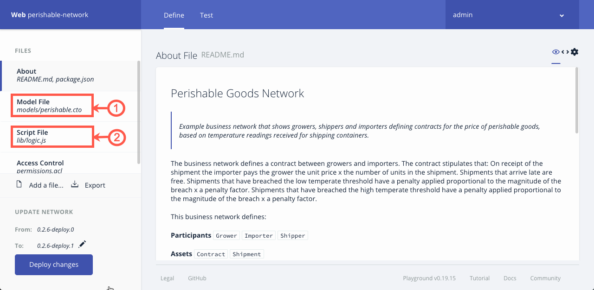

13. Now let's test our work! Click on the **Test** tab at the top of the page.
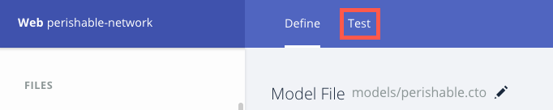

14. First, select **Submit Transaction** so we can run our *setupDemo* transaction to give us some default values.


15. From the *drop down*, select **SetupDemo** and then **Submit**.
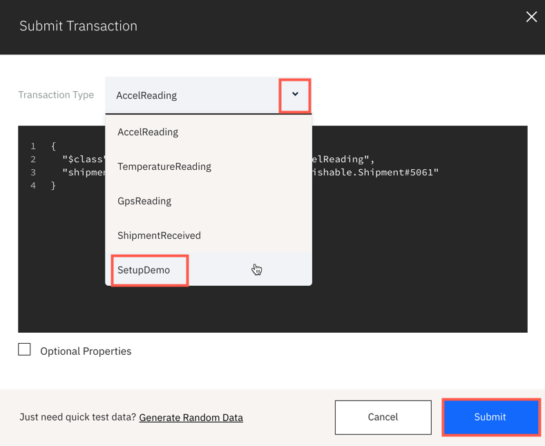

16. Look through your three partipants and two assets. You should now have a defined Grower, Importer, Shipper, Shipment and Contract.

17. Play with the other transactions to make sure that they update your assets. You should see fields added to your shipment in particular like the example below. You can enter any data. It doesn't need to be realistic.
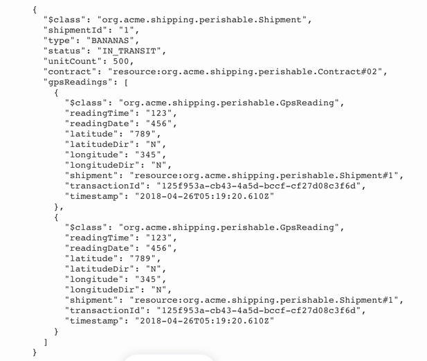

18. **Export** the code to your local system. We will use it during the deployment process.
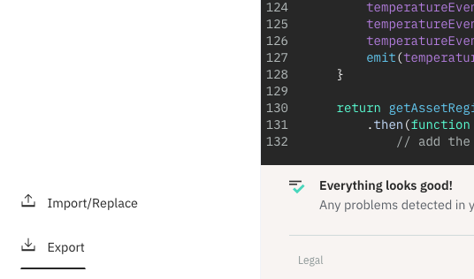

19. Save the business network archive, **perishable-network.bna**, somewhere you can easily find it.
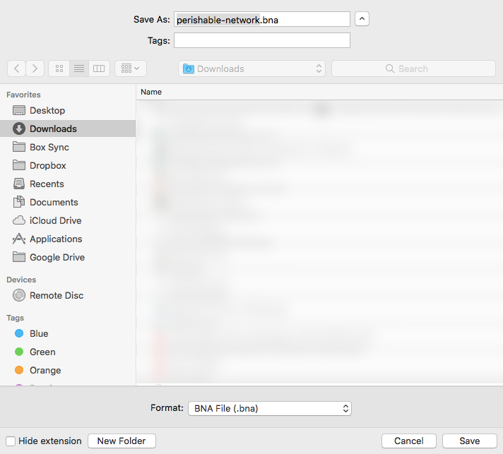

## Blockchain Part B - Implement a Perishable Business Network
Now it's time for the fun to begin! We are going to break this down into two sections:

* [Deploying your blockchain network to your IBM Blockchain Starter Plan](#deploy-your-network)
* [Generating your API for your deployed blockchain network with Hyperledger Composer Rest Server](#working-with-the-rest-api)


### Deploy your network
Now that you've created your blockchain application, it's time to make it run on the IBM Blockchain Starter Plan. To do that, we are going to use the DevOps service in the IBM Cloud to deploy our code and start a REST server. This entire process is documented [here](https://github.com/sstone1/blockchain-starter-kit/blob/master/README.md) if you are interested in doing something similar outside of this exercise. This process will create the IBM Blockchain Starter Plan for you. 

**NOTE:** You may have to upgrade your IBM Cloud account to a pay-as-you-go account to use the IBM Blockchain Starter Plan. It is free for up to 30 days. It is your responsibility to monitor usage to avoid fees.

This breaks down into the following steps:
* [Create a DevOps toolchain](#create-a-devops-toolchain)
* [Installing Hyperledger Composer locally](#install-hyperledger-composer-locally)
* [Moving your code into your repository](#prepare-your-code-for-deployment)
* [Verifying deployment of code](#verify-deployment)

#### Create a DevOps toolchain
1. Start [here](https://console.bluemix.net/devops/setup/deploy/?repository=https%3A//github.com/sstone1/blockchain-starter-kit&branch=master&env_id=ibm%3Ayp%3Aus-south) to create your DevOps toolchain. 

2. Enter a name for your toolchain. Make it unique!

  **Note:** If you haven't authenticated with GitHub in IBM Cloud before, you will need to do this before you will be able to create the Blockchain Starter Kit. You can do this now by scrolling down on this screen and selecting the authenticate button.

  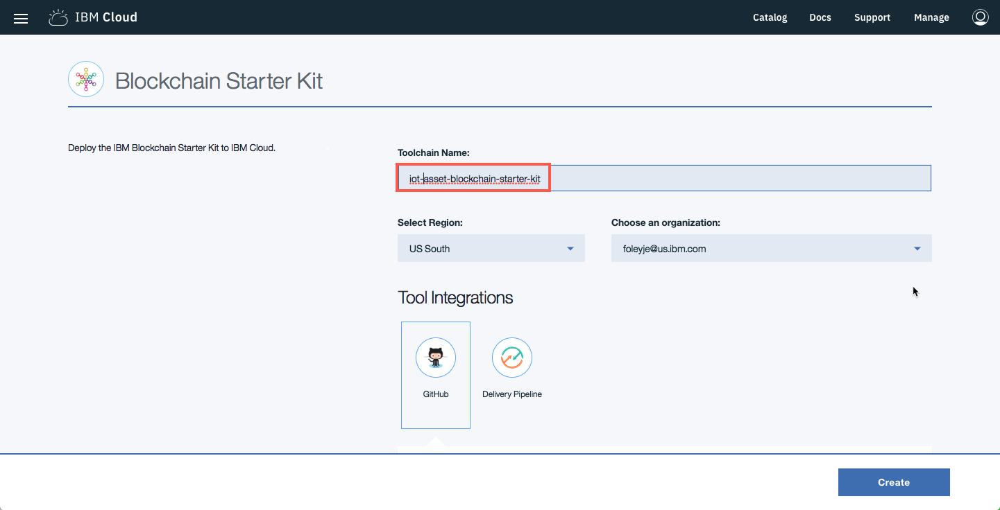

3. Scroll down and create a unique repository name, **XXX-blockchain-toolkit** where XXX are your initials.

4. Click **Create**.
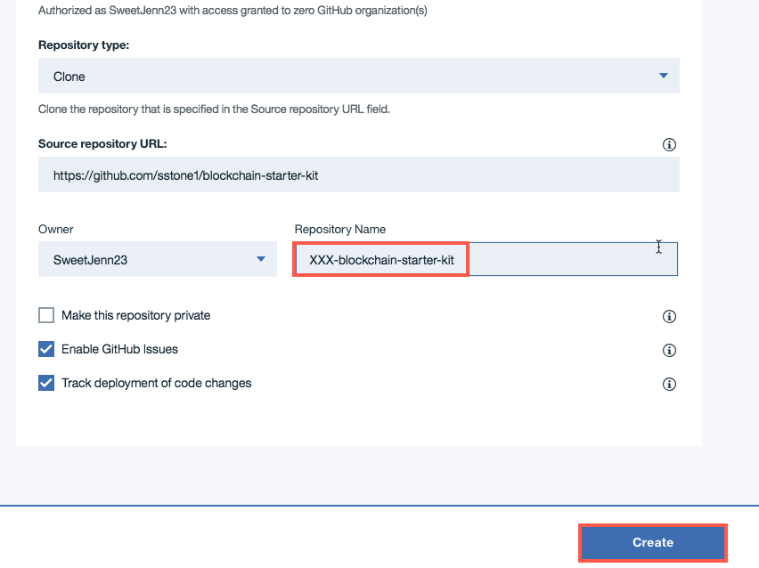

5. Congratulations! You have a complete toolchain that can be used to deploy your code.
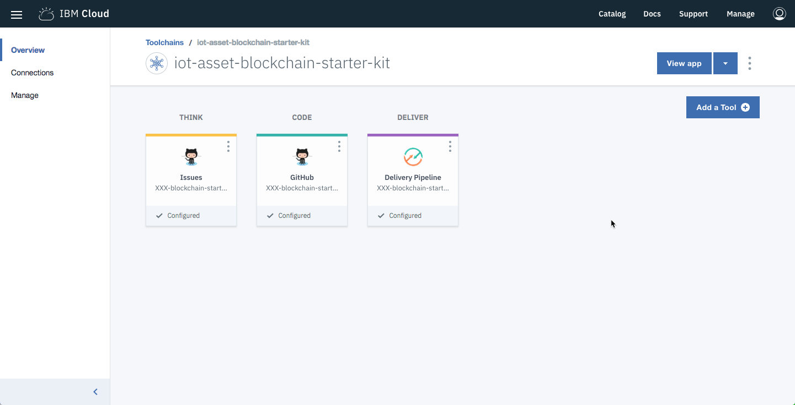

The "GitHub" button in the middle will take you to your newly created GitHub repository. You will clone this GitHub repository into your local development environment, so you can work on your blockchain application.

The "Delivery Pipeline" button on the right will take you to the delivery pipeline for your DevOps toolchain. From here, you can inspect the output from the latest automated build and deployment of your blockchain application.

#### Install Hyperledger Composer locally
To deploy our code, we'll need to work with some of the Hyperledger Composer commands on our system.

1. Follow the [directions](https://hyperledger.github.io/composer/latest/installing/installing-index) for installing the prerequisites and installing Hyperledger Composer. 
* Only complete Step 1 and Step 2 of installing Hyperledger Composer for this exercise.

#### Prepare your code for deployment
1. In your toolchain, select the **GitHub** icon to open your newly created repository.
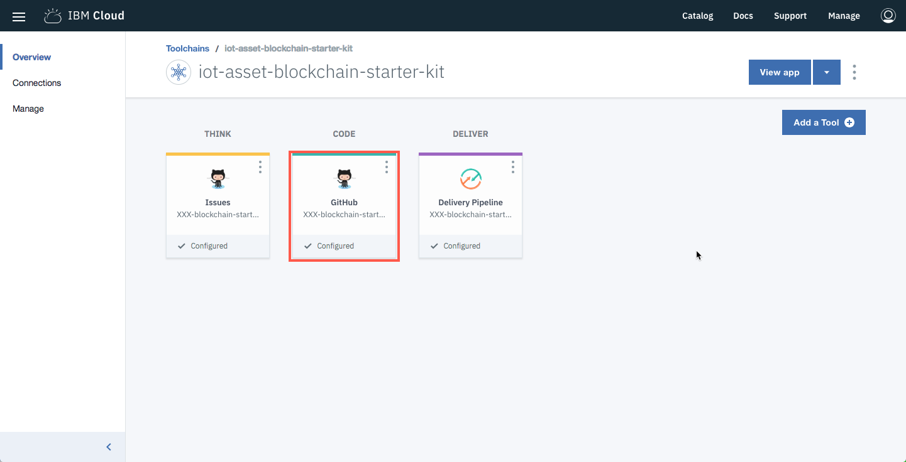

2. In GitHub, click **Clone or download** and then the **copy** button to get the URL to use to clone your repository to your local system.
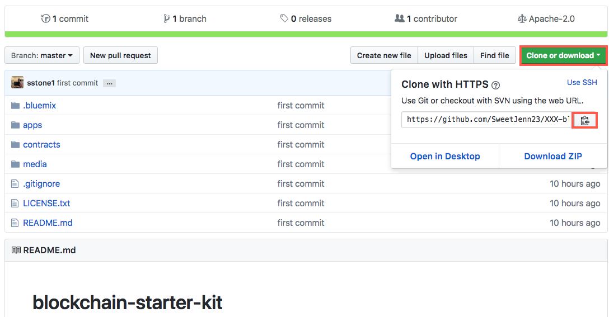

3. In a terminal on your local system, enter `git clone <URL>` where \<URL\> is the value you copied in the previous step.
```
$ git clone https://github.com/SweetJenn23/XXX-blockchain-starter-kit.git
Cloning into 'XXX-blockchain-starter-kit'...
remote: Counting objects: 40, done.
remote: Compressing objects: 100% (35/35), done.
remote: Total 40 (delta 2), reused 40 (delta 2), pack-reused 0
Unpacking objects: 100% (40/40), done.
```

4. Move into the contracts directory, `cd XXX-blockchain-starter-kit/contracts` where XXX are your initials.

5. We need to make a smart contract from our blockchain network (.bna). To do this we will use one of the tools installed with Hyperledger Composer called Yeoman. This will create a smart contract skeleton we can deploy to Hyperledger Fabric. We will have to copy our work into this skeleton. 

To make the skeleton, type `yo` into a terminal on your local system and create a business network named **XXX-perishable-network** where XXX are your initials. Complete the rest of the information in the prompts.
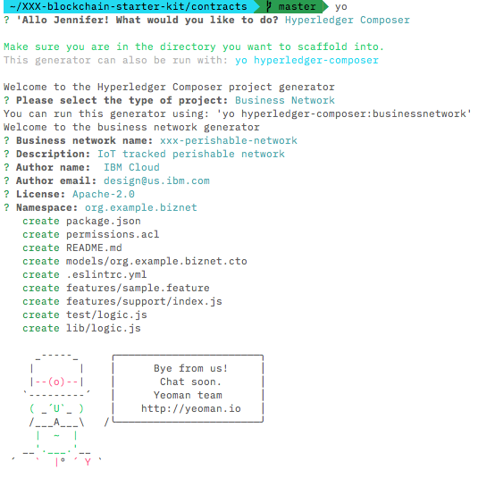

6. To copy our code into the skeleton you'll need to expand the business network archive.
* In your terminal, change directory to where your **perishable-network.bna** is saved.
* Change the extension on the file. `mv perishable-network.bna perishable-network.zip`
* Unzip the file. `unzip perishable-network.zip`
```
> unzip perishable-network.zip
Archive:  perishable-network.zip
 extracting: package.json
 extracting: README.md
 extracting: permissions.acl
   creating: models/
 extracting: models/perishable.cto
   creating: lib/
 extracting: lib/logic.js
```
7. Copy the extracted files into your cloned GitHub directory, */XXX-blockchain-starter-kit/contracts/xxx-perishable-network*. Replace the files already in the *xxx-perishable-network* directory with the same name. Do this for all of the following files:
* remove `/xxx-blockchain-starter-kit/contracts/xxx-perisable-network/lib/org.acme.biznet.perishable.cto`
* copy `perishable-network/README.md` to `XXX-blockchain-starter-kit/contracts/xxx-perishable-network`
* copy `perishable-network/permissions.acl` to `XXX-blockchain-starter-kit/contracts/xxx-perishable-network`
* copy `perishable-network/models/perishable.cto` to `XXX-blockchain-starter-kit/contracts/xxx-perishable-network/models/`
* copy `perishable-network/lib/logic.js` to `XXX-blockchain-starter-kit/contracts/xxx-perishable-network/lib/`
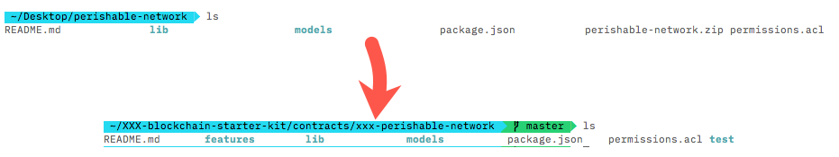

8. In your repository edit the file, **~/XXX-blockchain-starter-kit/.bluemix/pipeline_BUILD.sh**

   * Find **function test_composer_contract**

   * In the function comment out the line  **npm test**, `#npm test`
```
     function test_composer_contract {
       CONTRACT=$1
       echo testing composer contract ${CONTRACT}
       pushd contracts/${CONTRACT}
       npm install
       #npm test
       rm -rf node_modules
       popd
     }
```

9. To commit the code to your repository on GitHub for the toolchain you'll need to use the following in a terminal in your **XXX-blockchain-starter-kit** directory:
* `git add -A`
* `git commit -m "Update files"`
* `git push`
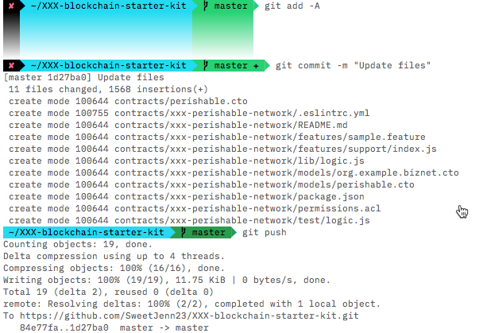


#### Verify deployment
When you committed your code to GitHub, the DevOps toolchain automatically picked up the changes. The toolchain will immediately begin deploying those changes.

1. Navigate to the DevOps toolchain page, and click on the "Delivery Pipeline" button. You should see the following page, giving you an overview of the current status of your delivery pipeline:
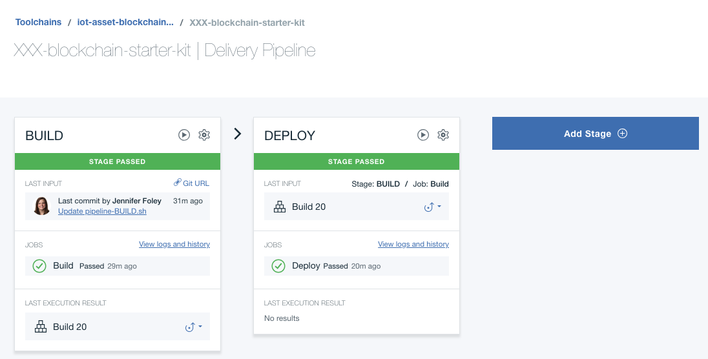

2. The delivery pipeline is made up of two phases, "BUILD" and "DEPLOY".

The "BUILD" phase of the delivery pipeline clones your GitHub repository, installs any dependencies, and runs all of the automated unit tests for all of your smart contracts. If any unit tests fail, then the delivery pipeline will fail and your changes will not be deployed.

The "DEPLOY" phase of the delivery pipeline deploys your smart contracts into the IBM Cloud. It is reponsible for provisioning and configuring an instance of the IBM Blockchain Platform: Starter Plan (the blockchain network), an instance of Cloudant (the wallet for blockchain credentials), deploying the smart contracts, and deploying RESTful API servers for each deployed smart contract.

If you click "View logs and history", you can see the latest logs for your build:
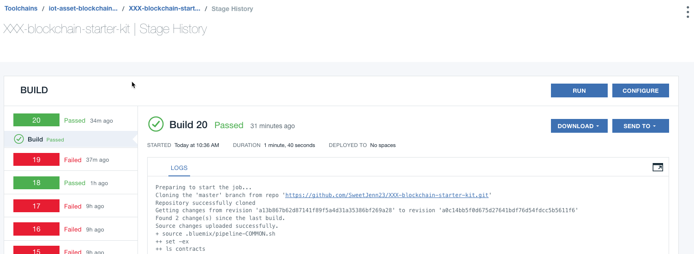

Both "BUILD" and "DELIVERY" phases should be green and showing that no errors have occurred. If this is not the case, you must use the logs to investigate the cause of the errors.

### Working with the REST API

To manipulate the blockchain from Node-RED, we will expose the perishable-network business network using the Hyperledger Composer REST API. Currently, this starter kit does not deploy a RESTful API server for smart contracts developed using Hyperledger Fabric. Since we used Hyperledger Composer, the DevOps toolchain has automatically deployed a RESTful API server for each deployed smart contract. You can use these RESTful APIs to build end user applications that interact with a smart contract.

1. The URLs for the deployed RESTful API servers are available in the logs for the "DELIVERY" phase, but you can also find them in the [IBM Cloud Dashboard](https://console.bluemix.net/dashboard/apps). The RESTful API server is deployed as an application, with a name made up of "composer-rest-server-" and the name of the smart contract. Ours are called **composer-rest-server-xxx-perishable-network**.
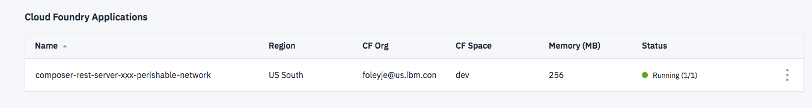

2. Click on the rest server to navigate to the application details page.


3. Select the **Visit App URL** to view your API.
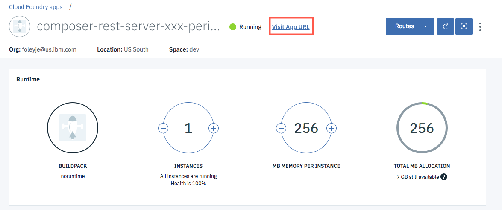

4. These APIs are how Node-RED will communicate with blockchain.
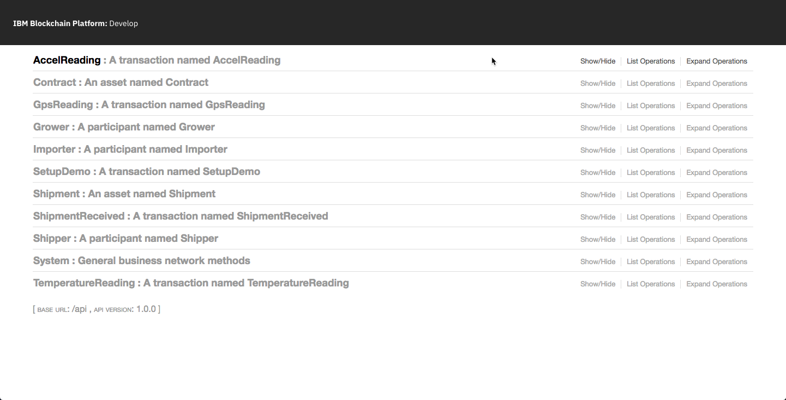


Congratulations!  You have completed the Blockchain section of the workshop.  Proceed to the [Node-RED section](../Node-RED/README.md) which will leverage the REST API you just enabled to write / read / visualize IoT Asset environmental sensor data to the transaction history.
