# Node-RED - IoT Asset Tracker
## Node-RED - IoT Asset Tracker Introduction

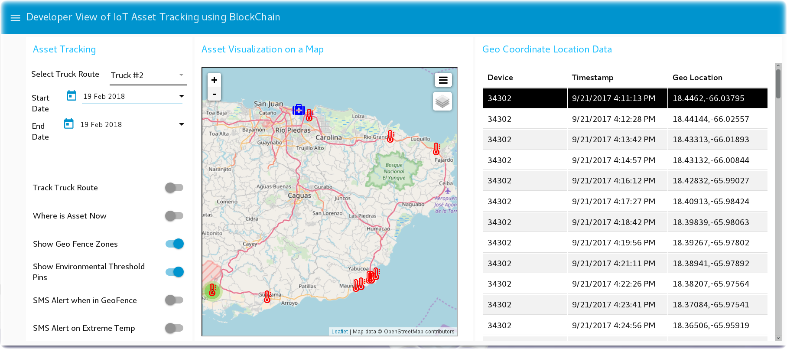

These Node-RED program flows implement an IoT Asset Tracker that receives geolocation and environmental sensor data from a Particle Electron, stores that information in a Hyperledger Fabric blockchain and visualizes the routes of the IoT devices on a map / dashboard. It triggers alerts when environmental thresholds are exceeded.

During this workshop you will copy the flows from github and deploy them into your to Watson IoT / Node-RED Starter application running on IBM Cloud.

These six flows perform the following functions:

* **Control a Particle Electron** - A Node-RED Dashboard which enables/disables/configures a Particle Electron.
* **Receive Particle Electron events** - subscribe to Particle Electron event handlers
* **Write Particle Electron data** to a Hyperledger Fabric Blockchain
* **Load Blockchain Transaction History** so the IoT device routes can be plotted
* **Build a Dashboard** that controls the visualization of devices.
* **Move a IoT asset along its recorded history** by visualizing the route on a map

The dashboards are not intended to be a fancy user experience for end users.  These dashboards are demonstrations for a developer of what an IoT Asset Tracker might be capable of.  End users are not likely to be interested in geolocation coordinates.

## Getting started with Node-RED in the IBM Cloud
Before you can deploy the IoT Asset Tracker, you need to create a IoT Starter application in the IBM Cloud.  This section walks you through those steps.
### Create an Internet of Things Starter App
* Create an account and log into [IBM Cloud](http://bluemix.net)
* Click on the Catalog **(1)** and search for 'internet of things' **(2)**
* The Internet of Things Platform Starter **(3)** boilerplate is a pattern with pre-assembled services that work together.  The Internet of Things Platform Starter includes a Node-RED Node.js web server, Cloudant database to store the sensor data, and the IoT platform service so you can connect devices.
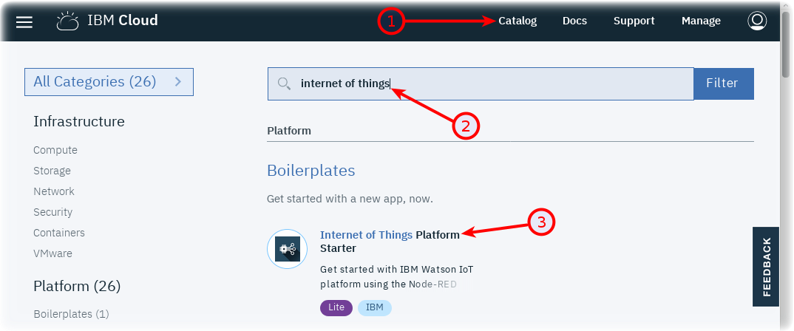
* Name your application something unique. If you choose myapp, your application will be located at http://myapp.mybluemix.net   There can only be one “myapp” application and URL registered in IBM Cloud.
* Give the application a unique name **(4)** - eg. IoTAssetTracker-yourname
* Press the Create button **(5)**.
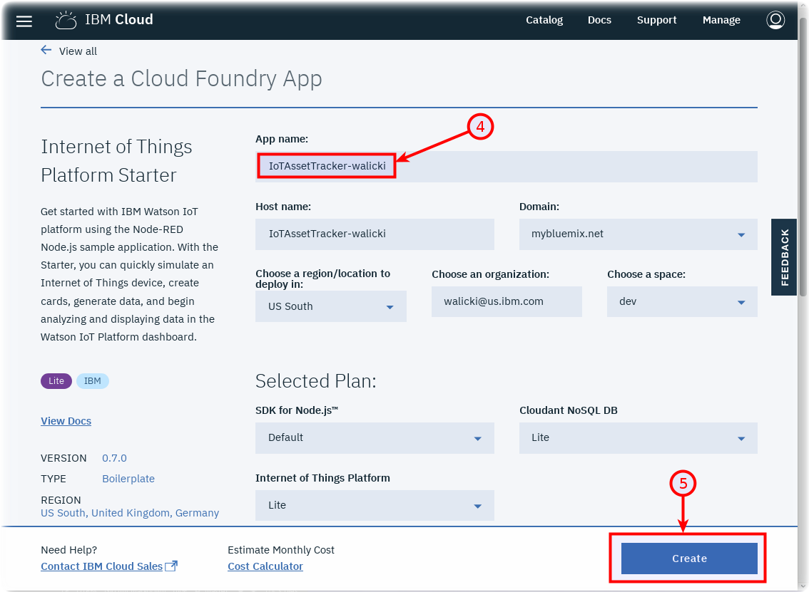
* IBM Cloud will create an application in your account based on the services in the boilerplate. This is called staging an application. It can take a few minutes for this process to complete.  While you wait, you can click on the Logs tab and see activity logs from the platform and Node.js runtime.

### Launch the IoT Starter Application
Once the Green “Running” icon appears, Click the  Visit App URL link **(6)**
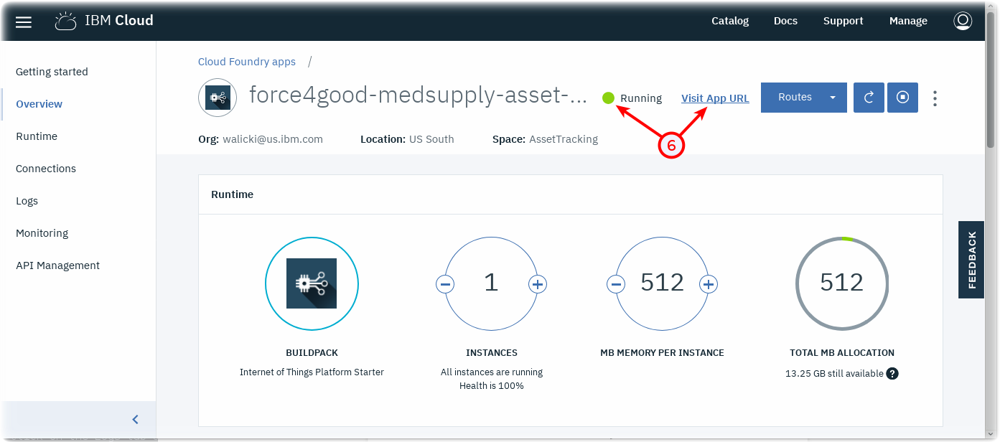

### Open the Node-RED visual programming editor
A new browser tab will open to the Node-RED start page.  Node-RED is an open-source Node.js application that provides a visual programming editor that makes it easy to wire together flows. Select a username / password to access the Node-RED editor. Remember your username / password. Click the red button Go to your Node-RED flow editor  to launch the editor.
* The Node-RED Visual Programming Editor will open with a default flow.
* On the left side is a palette of nodes that you can drag onto the flow.
* You can wire nodes together to create a program.
* The sample IoT Starter flow is not applicable to this workshop and can be deleted.
* We will import the flows discussed above.

### Install Additional Node-RED nodes
The IoT Starter Application deployed into IBM Cloud includes just a small subset of Node-RED nodes. The Node-RED palette can be extended with over one thousand additional nodes for different devices and functionality.  These NPM nodes can be browsed at http://flows.nodered.org
In this Step, you will add the Node-RED Dashboard nodes to your Internet of Things Starter Application.
* Click on the Node-RED Menu **(1)** in the upper right corner, then Manage palette **(2)**

* Turn to the Install tab **(3)**, type node-red-dashboard **(4)** and press the Install button **(5)**.

* Press the Install button in the next dialog.
* Repeat **(4)** to install **node-red-contrib-particle and node-red-contrib-web-worldmap**

### Import a prebuilt flow from GitHub
Since configuring Node-RED nodes and wiring them together requires many steps to document in screenshots, there is an easier way to build a flow by importing a prebuilt flow into your IoT Starter Application.

* Each section below will have a **Get the Code** link.

* When instructed, open the “Get the Code” github URL, mark or Ctrl-A to select all of the text, and copy the text for the flow to your Clipboard.
* Click on the Node-RED Menu **(6)**, then Import **(7)**, then Clipboard **(8)**.

* Paste the text of the flow into the **Import nodes** dialog and press the red **Import** button.

* The new flow will be imported into a **new tab** in the Node-RED Editor.

## Control Particle Electron events
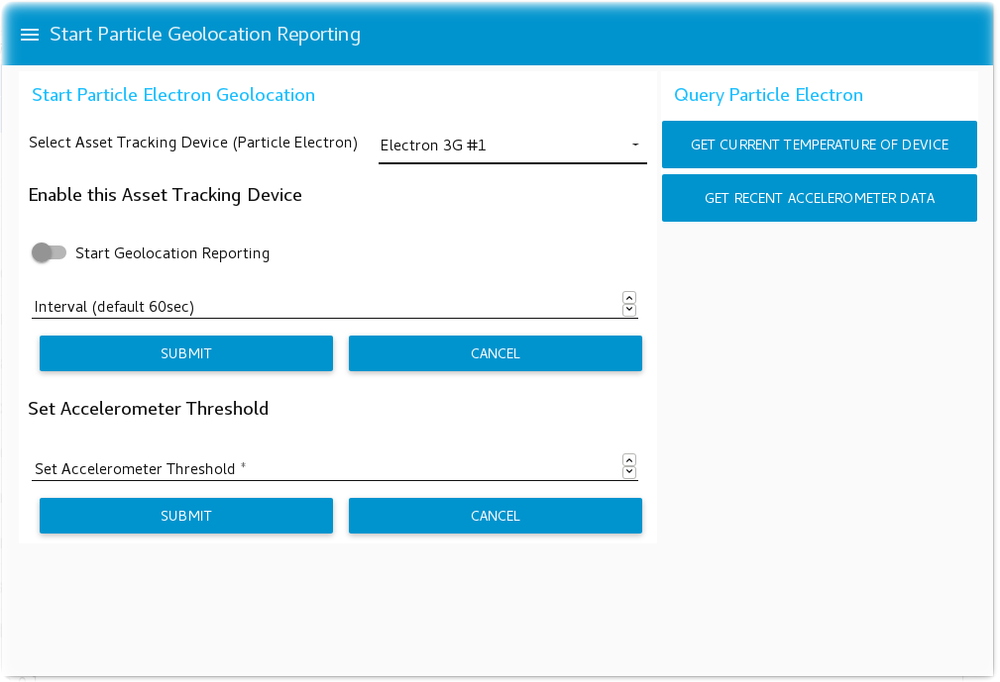
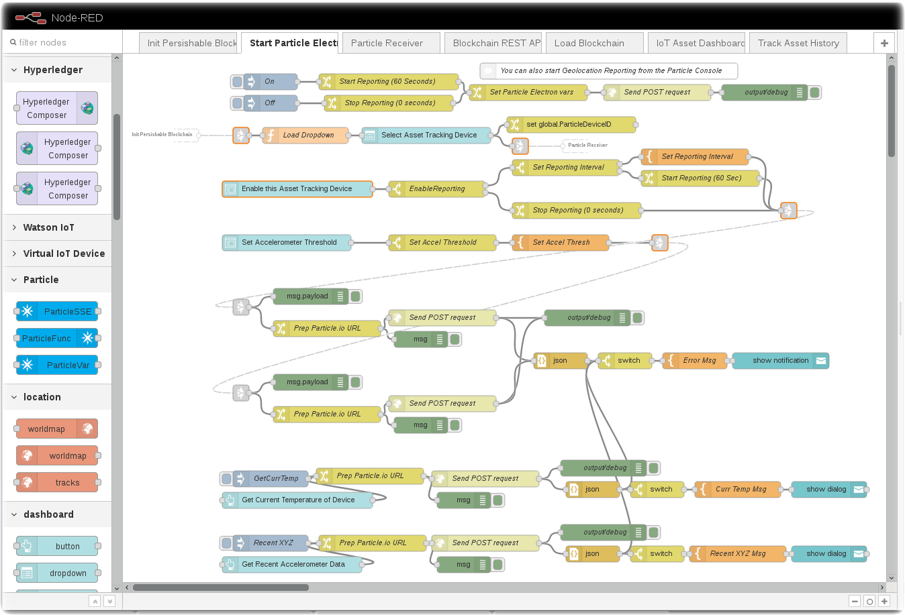
Link to [IoT Asset Tracker Node-RED flow - Control Particle Device ](flows/IoTAssetTracker-ControlParticleElectrons.json)

## Receive Particle Electron events
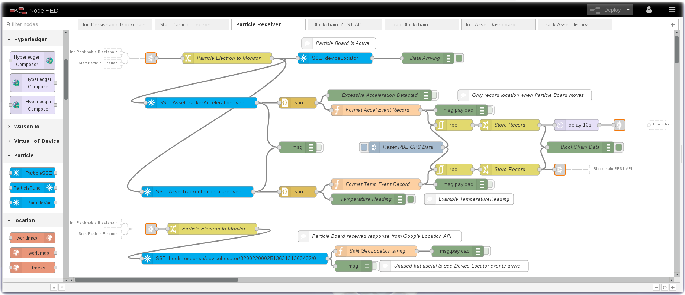
Link to [IoT Asset Tracker Node-RED flow - Receive Particle Events ](flows/IoTAssetTracker-ReceiveParticleEvents.json)

## Write Particle Events to Hyperledger Perishable Network Blockchain
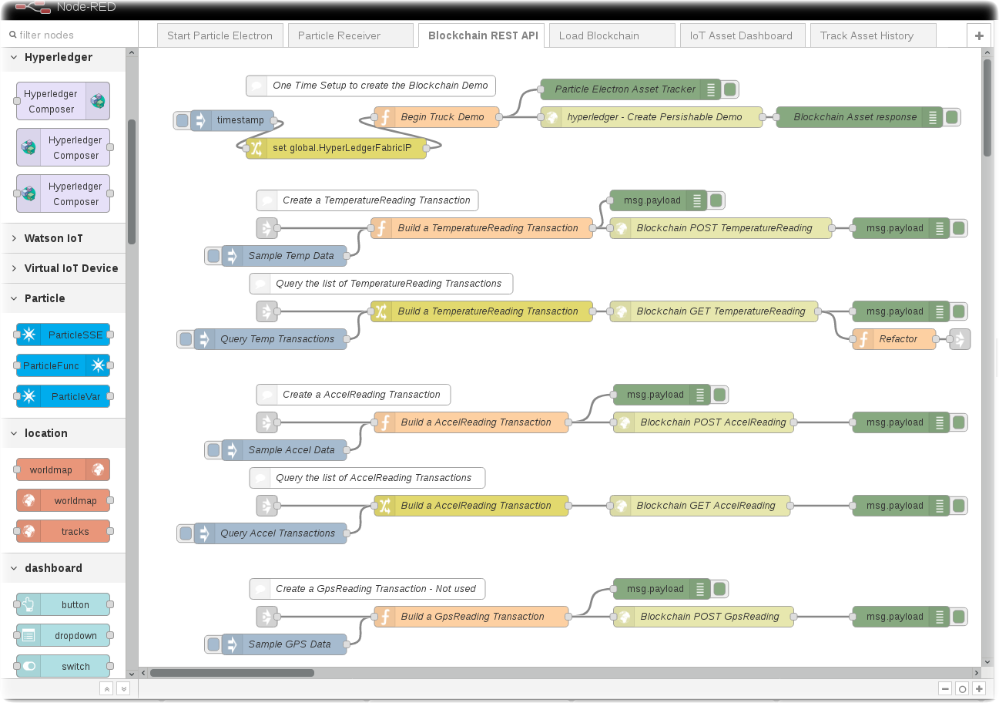
Link to [IoT Asset Tracker Node-RED flow - Write Particle Events to Blockchain via REST APIs](flows/IoTAssetTracker-BlockchainRESTAPI.json)

## Load Perishable Network Blockchain Transaction History
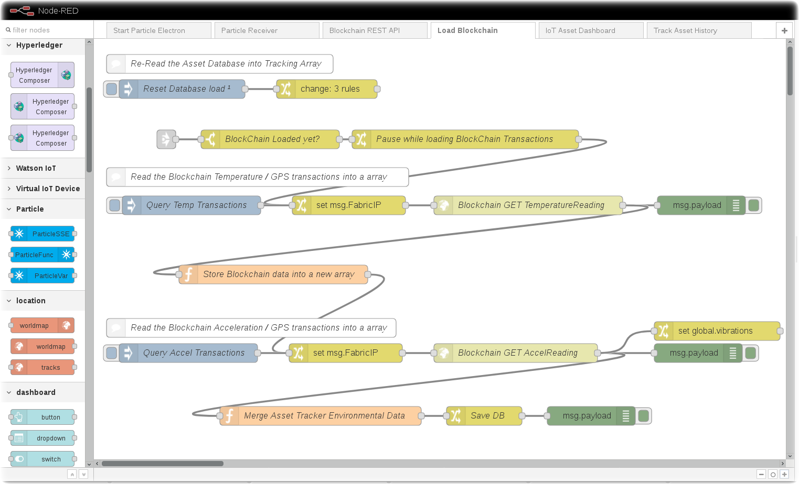
Link to [IoT Asset Tracker Node-RED flow - Read Blockchain Transaction History ](flows/IoTAssetTracker-LoadBlockchainTransactionHistory.json)

## Build an Asset Tracking Dashboard
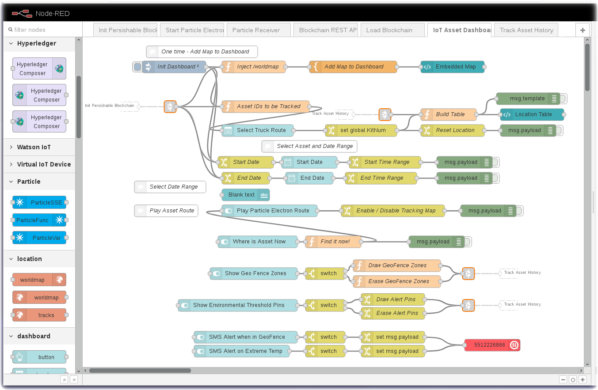

Link to [IoT Asset Tracker Node-RED flow - Build a Dashboard](flows/IoTAssetTracker-DashboardControls.json)

## Move the Tracked Device on a Map
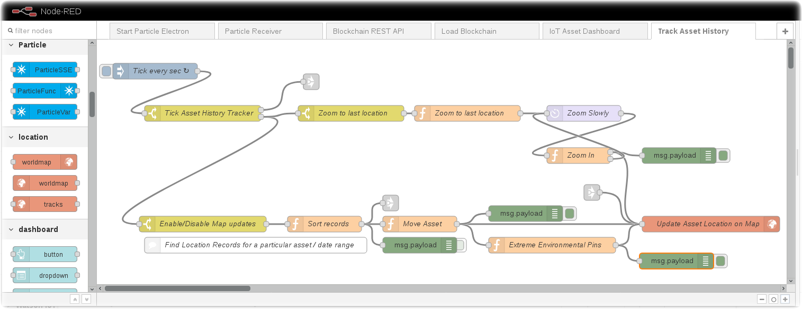
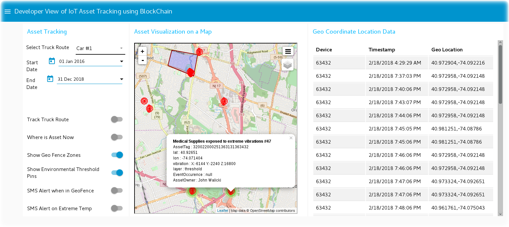

Link to [IoT Asset Tracker Node-RED flow - Move on Device on a Map](flows/IoTAssetTracker-MapMove.json)
