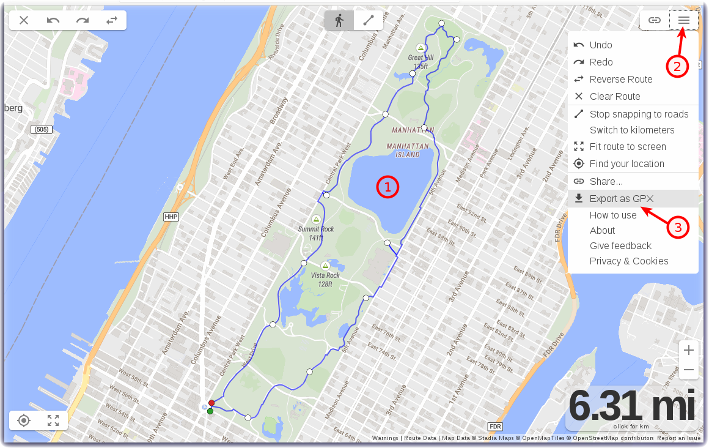
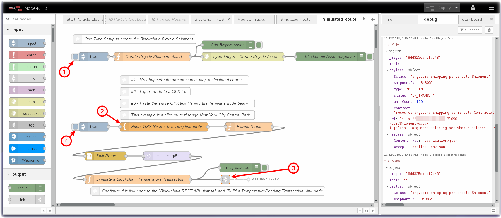
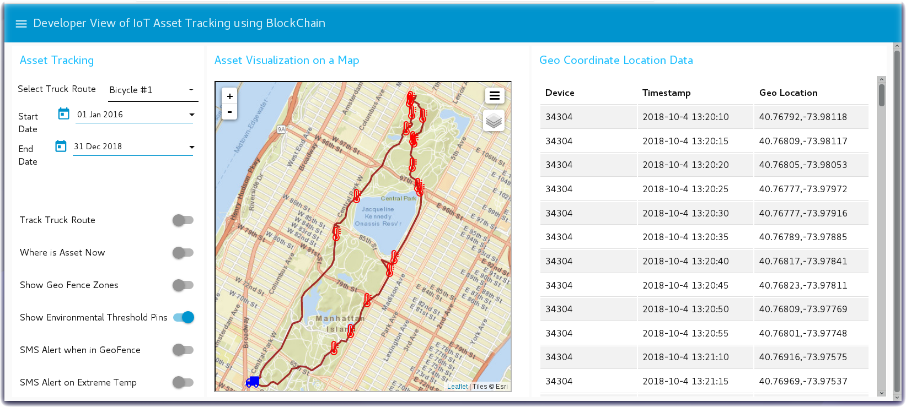

# Route Simulator for the Blockchain IoT Asset Tracker

## Introduction

If you have not purchased a Particle Electron but are interested in completing
the [IoT Asset Tracking using Hyperledger Blockchain IBM Code Pattern](https://developer.ibm.com/code/patterns/develop-an-iot-asset-tracking-app-using-blockchain/), you can
use the instructions on this page to create a simulated route and generate
some temperature transactions that will be written to the
IoT Asset Tracker Blockchain history.

This Node-RED flow replaces the physical Particle Electron.  You can
optionally use the technique described below to create your own route and
temperature event thresholds.

## Use Case - Simulated Bicycle Ride through New York City Central Park
In the below Node-RED flow, the simulator plots a course around Central Park
New York City.  The story might be that you want to use the IoT Asset Tracker
to track a bicycle ride through the park on a nice day. The rough outline is to generate the GPS coordinates, fake timestamps, fake temperature, fake vibration data then play it all into your Blockchain transaction history.

You can create your own use case stories with simulated routes / simulated data and then play that data into the Blockchain.

The next section describes the generate technique of how you can build your own unique route. If you want to skip creating your own route, jump straight to the section to import the Bicycle ride through New York Central Park simulator flow.

### General Technique - Build your our unique route
- Visit the [OnTheGoMap website](https://onthegomap.com/#/create) that allows you to plot a route on a world map.
- Create your route **(1)** using [OnTheGoMap](https://onthegomap.com/#/create)
- Click on the **Menu** in the upper right corner **(2)**
- Select **Export as GPX (3)**
- **Save** the file to your local system.

- **Inspect** this xml file.  Depending on the length of your route, it will likely contain thousands of geocode waypoints.
- That is way too much accuracy, you don't really want to load thousands of geolocation transactions into the Blockchain.  You probably only need a few hundred for demo purposes.
- The Node-RED dashboard that you will build in the final section of the workshop advances the little icon at one geolocation transaction per second.  No one wants to watch your demo truck icon creep along a route for dozens of minutes to complete. Slice the data down to maybe 2-3 minutes per route.  Determine the appropriate modulo to prune the data.  Unix is awesome for this and there are several command line tools that can help you slice the data:
```
$ awk '0 == NR % 14'  onthegomap-6.4-mi-route-route.gps
$ sed -n '0-14p'   onthegomap-6.4-mi-route-route.gps
```
- Now, we can load those abbreviated geolocation coordinates into the blockchain.

## Node-RED Flow to load the Blockchain

- Copy the code from the GitHub link below into your Clipboard and import it into your Node-RED editor.

Get the Code [Simulator Node-RED flow for IoT Asset Tracker](flows/IoTAssetTracker-SimulatedRoute.json)



- Wire the **Link** node **(3)** on this flow to the Blockchain REST API flow **New Tempeature Reading** link node.
- Deploy the flow.
- Press the **One Time Setup to create the Blockchain Bibcycle Shipment** inject (true) node. **(1)**
- The one time setup is required to create the shipment
- Either accept the default NYC Central Park route or insert your custom route into the **Paste GPX file into this Template Node** **(2)**
- Last, press the **Inject** true button **(4)**.

## Node-RED Dashboard

